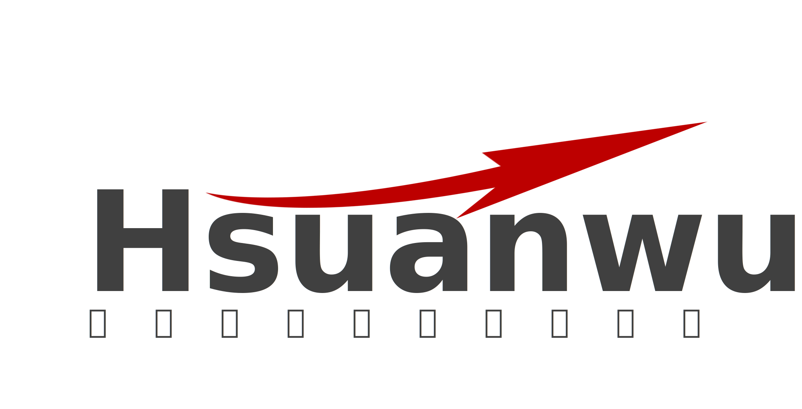
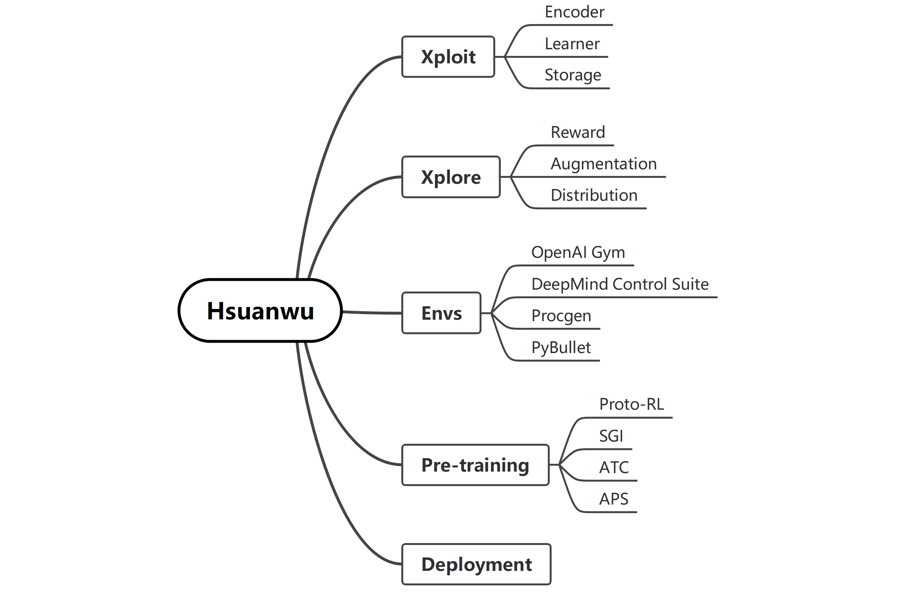

          

**Hsuanwu: Long-Term Evolution Project of Reinforcement Learning** is inspired by the long-term evolution (LTE) standard project in telecommunications, which aims to track the latest research progress in reinforcement learning (RL) and provide stable and efficient baselines. The highlight features of Hsuanwu:

- 🧱 Complete decoupling of RL algorithms, and each module can be invoked separately;
- 📚 Large number of reusable bechmarking results ([See Benchmarks](benchmark.hsuanwu.dev));
- 🛠️ Support for RL model engineering deployment (C++ API);
- 🚀 Minimizing the CPU to GPU data transferring to realize full GPU-acceleration.

See the project structure below:

# Qucik Start

# API Documentation
See our [documentation](docs.hsuanwu.dev).

