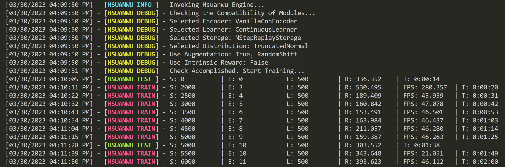

<div align=center>

</div>

          

**Hsuanwu: Long-Term Evolution Project of Reinforcement Learning** is inspired by the long-term evolution (LTE) standard project in telecommunications, which aims to track the latest research progress in reinforcement learning (RL) and provide stable and efficient baselines. The highlight features of Hsuanwu:


- 🧱 Complete decoupling of RL algorithms, and each module can be invoked separately;
- 📚 Large number of reusable bechmarking results ([See Benchmarks](benchmark.hsuanwu.dev));
- 🛠️ Support for RL model engineering deployment (C++ API);
- 🚀 Minimizing the CPU to GPU data transferring to realize full GPU-acceleration;
- 📋 Elegant experimental management powered by [Hydra](https://hydra.cc/).

See the project structure below:
<div align=center>

</div>

# Qucik Start
## Installation
- with pip `recommended`

Open up a terminal and install Hsuanwu with `pip`:
```
pip install hsuanwu
```

- with git

Open up a terminal and clone the repository from [GitHub](https://github.com/RLE-Foundation/Hsuanwu) witg `git`:
``` sh
git clone https://github.com/RLE-Foundation/Hsuanwu.git
```
After that, run the following command to install package and dependencies:
``` sh
pip install -e .
```

## Build your first Hsuanwu application
For example, we want to use [DrQ-v2](https://openreview.net/forum?id=_SJ-_yyes8) to solve a task of [DeepMind Control Suite](https://github.com/deepmind/dm_control), and we need the following two steps:

1. Copy the [config.yaml](https://github.com/RLE-Foundation/Hsuanwu/blob/main/cfgs/config.yaml) file to your working directory:

2. Write a `train.py` file like:
``` python
import hydra

from hsuanwu.env import make_dmc_env
from hsuanwu.common.engine import OffPolicyTrainer # Select trainer

train_env = make_dmc_env(env_id='cartpole_balance') # Create train env
test_env = make_dmc_env(env_id='cartpole_balance') # Create test env

@hydra.main(version_base=None, config_path='./', config_name='config')
def main(cfgs):
    trainer = OffPolicyTrainer(
        train_env=train_env, 
        test_env=test_env, 
        cfgs=cfgs)
    trainer.train() # Start training

if __name__ == '__main__':
    main()
```
Run `train.py` and you will see the following output:
<div align=center>

</div>

# API Documentation
View our well-designed documentation: [https://docs.hsuanwu.dev/](https://docs.hsuanwu.dev/)

# How To Contribute
Welcome to contribute to this project! Before you begin writing code, please read [CONTRIBUTING.md](https://github.com/RLE-Foundation/Hsuanwu/blob/main/CONTRIBUTING.md) for guide first.

# Acknowledgment
This project is supported by [FUNDING.yml](https://github.com/RLE-Foundation/Hsuanwu/blob/main/.github/FUNDING.yml). Some code for this project is borrowed or inspired by several excellent projects, and we highly appreciate them. See [ACKNOWLEDGMENT.md](https://github.com/RLE-Foundation/Hsuanwu/blob/main/ACKNOWLEDGMENT.md).
