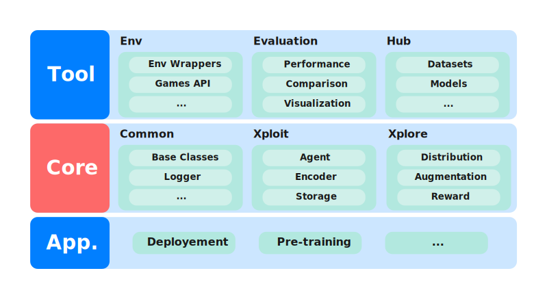
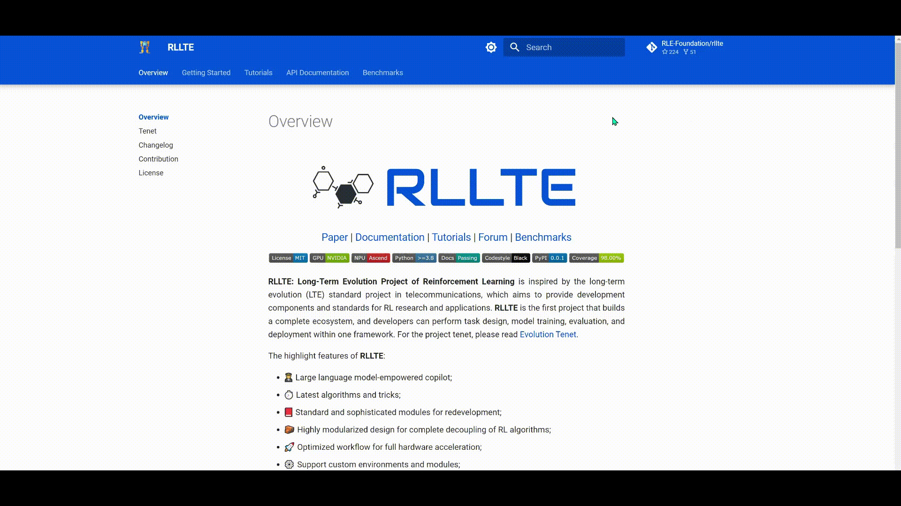

<div align=center>
<br>

<br>
RLLTE: Long-Term Evolution Project of Reinforcement Learning

<h3> <a href=""> Paper </a> |
<a href="https://docs.rllte.dev/api/"> Documentation </a> |
<a href="https://docs.rllte.dev/tutorials/"> Tutorials </a> |
<a href="https://github.com/RLE-Foundation/rllte/discussions"> Forum </a> |
<a href="https://hub.rllte.dev/"> Benchmarks </a></h3>

        

| [English](README.md) | [中文](docs/README-zh-Hans.md) |

</div>

# Contents
- [Overview](#overview)
- [Quick Start](#quick-start)
  + [Installation](#installation)
  + [Fast Training with Built-in Algorithms](#fast-training-with-built-in-algorithms)
    - [On NVIDIA GPU](#on-nvidia-gpu)
    - [On HUAWEI NPU](#on-huawei-npu)
  + [Three Steps to Create Your RL Agent](#three-steps-to-create-your-rl-agent)
  + [Algorithm Decoupling and Module Replacement](#algorithm-decoupling-and-module-replacement)
- [Function List (Part)](#function-list-part)
  + [RL Agents](#rl-agents)
  + [Intrinsic Reward Modules](#intrinsic-reward-modules)
- [RLLTE Ecosystem](#rllte-ecosystem)
- [API Documentation](#api-documentation)
- [Cite the Project](#cite-the-project)
- [How To Contribute](#how-to-contribute)
- [Acknowledgment](#acknowledgment)

# Overview
Inspired by the long-term evolution (LTE) standard project in telecommunications, aiming to provide development components for and standards for advancing RL research and applications. **RLLTE** is **not** designed to provide specific RL algorithms but a framework for producing algorithms.

<div align="center">
<a href="https://youtu.be/ShVdiHHyXFM" rel="nofollow">

</a>
<br>
An introduction to RLLTE.
</div>

Why **RLLTE**?
- 🧬 Long-term evolution for providing latest algorithms and tricks;
- 🏞️ Complete ecosystem for task design, model training, evaluation, and deployment (TensorRT, CANN, ...);
- 🧱 Module-oriented design for complete decoupling of RL algorithms;
- 🚀 Optimized workflow for full hardware acceleration;
- ⚙️ Support custom environments and modules;
- 🖥️ Support multiple computing devices like GPU and NPU;
- 💾 Large number of reusable benchmarks ([rllte-hub](https://hub.rllte.dev));
- 👨‍✈️ Large language model-empowered copilot.

See the project structure below:
<div align=center>

</div>

For more detailed descriptions of these modules, see [API Documentation](https://docs.rllte.dev/api).

# Quick Start
## Installation
- Prerequisites

Currently, we recommend `Python>=3.8`, and user can create an virtual environment by
``` sh
conda create -n rllte python=3.8
```

- with pip `recommended`

Open up a terminal and install **rllte** with `pip`:
``` shell
pip install rllte-core # basic installation
pip install rllte-core[envs] # for pre-defined environments
```

- with git

Open up a terminal and clone the repository from [GitHub](https://github.com/RLE-Foundation/rllte) with `git`:
``` sh
git clone https://github.com/RLE-Foundation/rllte.git
```
After that, run the following command to install package and dependencies:
``` sh
pip install -e . # basic installation
pip install -e .[envs] # for pre-defined environments
```

For more detailed installation instruction, see [Getting Started](https://docs.rllte.dev/getting_started).

## Fast Training with Built-in Algorithms
**RLLTE** provides implementations for well-recognized RL algorithms and simple interface for building applications.
### On NVIDIA GPU
Suppose we want to use [DrQ-v2](https://openreview.net/forum?id=_SJ-_yyes8) to solve a task of [DeepMind Control Suite](https://github.com/deepmind/dm_control), and it suffices to write a `train.py` like:

``` python
# import `env` and `agent` api
from rllte.env import make_dmc_env 
from rllte.agent import DrQv2

if __name__ == "__main__":
    device = "cuda:0"
    # create env, `eval_env` is optional
    env = make_dmc_env(env_id="cartpole_balance", device=device)
    # create agent
    agent = DrQv2(env=env, device=device, tag="drqv2_dmc_pixel")
    # start training
    agent.train(num_train_steps=500000, log_interval=1000)
```
Run `train.py` and you will see the following output:

<div align=center>

</div>

### On HUAWEI NPU
Similarly, if we want to train an agent on HUAWEI NPU, it suffices to replace `cuda` with `npu`:
``` python
device = "cuda:0" -> device = "npu:0"
```

## Three Steps to Create Your RL Agent
Developers only need three steps to implement an RL algorithm with **RLLTE**. The following example illustrates how to write an Advantage Actor-Critic (A2C) agent to solve Atari games. 
- Firstly, select a prototype:
``` py
from rllte.common.prototype import OnPolicyAgent
```
- Secondly, select necessary modules to build the agent:
``` py
from rllte.xploit.encoder import MnihCnnEncoder
from rllte.xploit.policy import OnPolicySharedActorCritic
from rllte.xploit.storage import VanillaRolloutStorage
from rllte.xplore.distribution import Categorical
```
- Run the `.describe` function of the selected policy and you will see the following output:
``` py
OnPolicySharedActorCritic.describe()
# Output:
# ================================================================================
# Name       : OnPolicySharedActorCritic
# Structure  : self.encoder (shared by actor and critic), self.actor, self.critic
# Forward    : obs -> self.encoder -> self.actor -> actions
#            : obs -> self.encoder -> self.critic -> values
#            : actions -> log_probs
# Optimizers : self.optimizers['opt'] -> (self.encoder, self.actor, self.critic)
# ================================================================================
```
This will illustrate the structure of the policy and indicate the optimizable parts. Finally, merge these modules and write a `.update` function:
``` py
from torch import nn
import torch as th

class A2C(OnPolicyAgent):
    def __init__(self, env, tag, seed, device, num_steps) -> None:
        super().__init__(env=env, tag=tag, seed=seed, device=device, num_steps=num_steps)
        # create modules
        encoder = MnihCnnEncoder(observation_space=env.observation_space, feature_dim=512)
        policy = OnPolicySharedActorCritic(observation_space=env.observation_space,
                                           action_space=env.action_space,
                                           feature_dim=512,
                                           opt_class=th.optim.Adam,
                                           opt_kwargs=dict(lr=2.5e-4, eps=1e-5),
                                           init_fn="xavier_uniform"
                                           )
        storage = VanillaRolloutStorage(observation_space=env.observation_space,
                                        action_space=env.action_space,
                                        device=device,
                                        storage_size=self.num_steps,
                                        num_envs=self.num_envs,
                                        batch_size=256
                                        )
        # set all the modules
        self.set(encoder=encoder, policy=policy, storage=storage, distribution=Categorical)
    
    def update(self):
        for _ in range(4):
            for batch in self.storage.sample():
                # evaluate the sampled actions
                new_values, new_log_probs, entropy = self.policy.evaluate_actions(obs=batch.observations, actions=batch.actions)
                # policy loss part
                policy_loss = - (batch.adv_targ * new_log_probs).mean()
                # value loss part
                value_loss = 0.5 * (new_values.flatten() - batch.returns).pow(2).mean()
                # update
                self.policy.optimizers['opt'].zero_grad(set_to_none=True)
                (value_loss * 0.5 + policy_loss - entropy * 0.01).backward()
                nn.utils.clip_grad_norm_(self.policy.parameters(), 0.5)
                self.policy.optimizers['opt'].step()
```
Then train the agent by
``` py
from rllte.env import make_atari_env
if __name__ == "__main__":
    device = "cuda"
    env = make_atari_env("PongNoFrameskip-v4", num_envs=8, seed=0, device=device)
    agent = A2C(env=env, tag="a2c_atari", seed=0, device=device, num_steps=128)
    agent.train(num_train_steps=10000000)
```
As shown in this example, only a few dozen lines of code are needed to create RL agents with **RLLTE**. 

## Algorithm Decoupling and Module Replacement
**RLLTE** allows developers to replace settled modules of implemented algorithms to make performance comparison and algorithm improvement, and both 
built-in and custom modules are supported. Suppose we want to compare the effect of different encoders, it suffices to invoke the `.set` function:
``` py
from rllte.xploit.encoder import EspeholtResidualEncoder
encoder = EspeholtResidualEncoder(...)
agent.set(encoder=encoder)
```
**RLLTE** is an extremely open framework that allows developers to try anything. For more detailed tutorials, see [Tutorials](https://docs.rllte.dev/tutorials).

# Function List (Part)
## RL Agents
|     Type    |  Algo. | Box | Dis. | M.B. | M.D. | M.P. | NPU |💰|🔭|
|:-----------:|:------:|:---:|:----:|:----:|:----:|:------:|:---:|:------:|:---:|
| On-Policy   | [A2C](https://arxiv.org/abs/1602.01783)    | ✔️   | ✔️    | ✔️    | ✔️    | ✔️    | ✔️   |✔️    |❌    |
| On-Policy   | [PPO](https://arxiv.org/pdf/1707.06347)    | ✔️   | ✔️    | ✔️    | ✔️    | ✔️    | ✔️   |✔️    |❌    |
| On-Policy   | [DrAC](https://proceedings.neurips.cc/paper/2021/file/2b38c2df6a49b97f706ec9148ce48d86-Paper.pdf)| ✔️   | ✔️    | ✔️    | ✔️    | ✔️    | ✔️   |✔️    | ✔️   |
| On-Policy   | [DAAC](http://proceedings.mlr.press/v139/raileanu21a/raileanu21a.pdf)| ✔️   | ✔️    | ✔️    | ✔️    | ✔️    | ✔️   |✔️    | ❌   |
| On-Policy   | [DrDAAC](https://proceedings.neurips.cc/paper/2021/file/2b38c2df6a49b97f706ec9148ce48d86-Paper.pdf)| ✔️   | ✔️    | ✔️    | ✔️    | ✔️    | ✔️   |✔️    | ✔️   |
| Off-Policy  | [DQN](https://training.incf.org/sites/default/files/2023-05/Human-level%20control%20through%20deep%20reinforcement%20learning.pdf) | ✔️   | ❌    | ❌    | ❌    | ✔️    | ✔️   |✔️    | ❌   |
| Off-Policy  | [DDPG](https://arxiv.org/pdf/1509.02971.pdf?source=post_page---------------------------)| ✔️   | ❌    | ❌    | ❌    | ✔️    | ✔️   |✔️    |❌    |
| Off-Policy  | [SAC](http://proceedings.mlr.press/v80/haarnoja18b/haarnoja18b.pdf)| ✔️   | ❌    | ❌    | ❌    | ✔️    | ✔️   |✔️    |❌    |
| Off-Policy  | [DrQ-v2](https://arxiv.org/pdf/2107.09645.pdf?utm_source=morioh.com)| ✔️   | ❌    | ❌    | ❌    | ❌    | ✔️   |✔️    |✔️    |
| Distributed | [IMPALA](http://proceedings.mlr.press/v80/espeholt18a/espeholt18a.pdf) | ✔️   | ✔️    | ❌    | ❌    | ✔️    | ❌   |❌    |❌    |

> - `Dis., M.B., M.D.`: `Discrete`, `MultiBinary`, and `MultiDiscrete` action space;
> - `M.P.`: Multi processing;
> - 🐌: Developing;
> - 💰: Support intrinsic reward shaping;
> - 🔭: Support observation augmentation. 


## Intrinsic Reward Modules
| **Type** 	| **Modules** 	|
|---	|---	|
| Count-based 	| [PseudoCounts](https://arxiv.org/pdf/2002.06038), [RND](https://arxiv.org/pdf/1810.12894.pdf) 	|
| Curiosity-driven 	| [ICM](http://proceedings.mlr.press/v70/pathak17a/pathak17a.pdf), [GIRM](http://proceedings.mlr.press/v119/yu20d/yu20d.pdf), [RIDE](https://arxiv.org/pdf/2002.12292) 	|
| Memory-based 	| [NGU](https://arxiv.org/pdf/2002.06038) 	|
| Information theory-based 	| [RE3](http://proceedings.mlr.press/v139/seo21a/seo21a.pdf), [RISE](https://ieeexplore.ieee.org/abstract/document/9802917/), [REVD](https://openreview.net/pdf?id=V2pw1VYMrDo) 	|

See [Tutorials: Use Intrinsic Reward and Observation Augmentation](https://docs.rllte.dev/tutorials/data_augmentation) for usage examples.

# RLLTE Ecosystem
Explore the ecosystem of RLLTE to facilitate your project:

- [Hub](https://docs.rllte.dev/benchmarks/): Fast training APIs and reusable benchmarks.
- [Evaluation](https://docs.rllte.dev/api/tutorials/): Reasonable and reliable metrics for algorithm evaluation.
- [Env](https://docs.rllte.dev/api/tutorials/): Packaged environments for fast invocation.
- [Deployment](https://docs.rllte.dev/api/tutorials/): Convenient APIs for model deployment.
- [Pre-training](https://docs.rllte.dev/api/tutorials/): Methods of pre-training in RL.
- [Copilot](https://docs.rllte.dev/copilot): Large language model-empowered copilot.

# API Documentation
View our well-designed documentation: [https://docs.rllte.dev/](https://docs.rllte.dev/)
<div align=center>

</div>

# How To Contribute
Welcome to contribute to this project! Before you begin writing code, please read [CONTRIBUTING.md](https://github.com/RLE-Foundation/rllte/blob/main/CONTRIBUTING.md) for guide first.

# Cite the Project
If you use **RLLTE** in your research, please cite this project like this:
``` tex
@software{rllte,
  author = {Mingqi Yuan, Zequn Zhang, Yang Xu, Shihao Luo, Bo Li, Xin Jin, and Wenjun Zeng},
  title = {RLLTE: Long-Term Evolution Project of Reinforcement Learning},
  url = {https://github.com/RLE-Foundation/rllte},
  year = {2023},
}
```

# Acknowledgment
This project is supported by [The Hong Kong Polytechnic University](http://www.polyu.edu.hk/), [Eastern Institute for Advanced Study](http://www.eias.ac.cn/), and [FLW-Foundation](FLW-Foundation). [EIAS HPC](https://hpc.eias.ac.cn/) provides a GPU computing platform, and [HUAWEI Ascend Community](https://www.hiascend.com/) provides an NPU computing platform for our testing. Some code of this project is borrowed or inspired by several excellent projects, and we highly appreciate them. See [ACKNOWLEDGMENT.md](https://github.com/RLE-Foundation/rllte/blob/main/ACKNOWLEDGMENT.md).
