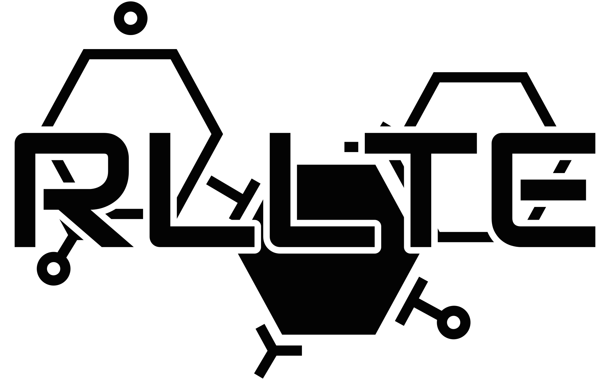
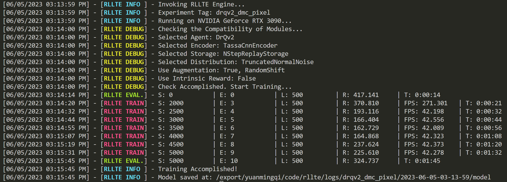
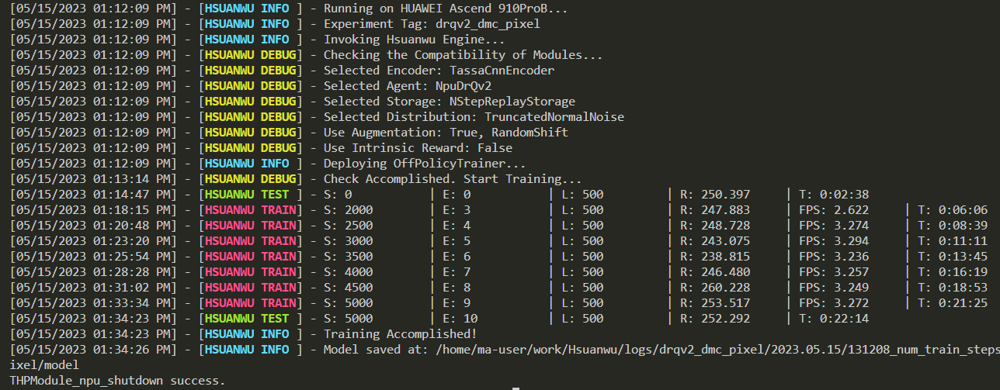
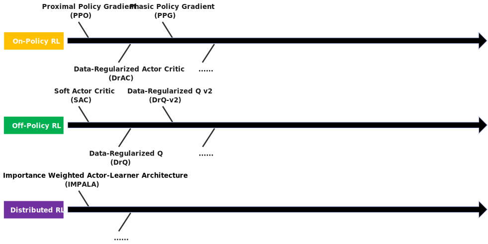

<div align=center>

</div>

|               |
|:-:|

**RLLTE: Long-Term Evolution Project of Reinforcement Learning** is inspired by the long-term evolution (LTE) standard project in telecommunications, which aims to track the latest research progress in reinforcement learning (RL) and provide stable and efficient baselines. In rllte, you can find everything you need in RL, such as training, evaluation, deployment, etc. The highlight features of rllte:

- ⏱️ Latest algorithms and tricks;
- 🧱 Highly modularized design for complete decoupling of RL algorithms;
- 🚀 Optimized workflow for full hardware acceleration;
- ⚙️ Support for custom environments;
- 🖥️ Support for multiple computing devices like GPU and NPU;
- 🛠️ Support for RL model engineering deployment (TensorRT, CANN, ...);
- 💾 Large number of reusable bechmarks ([See rllte-benchmark](benchmark.rllte.dev));
<!-- - 📋 Elegant experimental management powered by [Hydra](https://hydra.cc/). -->


<!-- Please cite the following paper if you use rllte in your work, thank you!
```bibtex
@article{yuan2023rllte,
  title={RLLTE: Long-Term Evolution Project of Reinforcement Learning},
  author={Yuan, Mingqi and Luo, Shihao and Zhang, Zequn and Yang, Xu and Jin, Xin and Li, Bo and Zeng, Wenjun},
  journal={arXiv preprint arXiv:2311.15277},
  year={2023}
}
``` -->

- [Quick Start](#quick-start)
  - [Installation](#installation)
  - [Start Training](#start-training)
    - [On NVIDIA GPU](#on-nvidia-gpu)
    - [On HUAWEI NPU](#on-huawei-npu)
- [Implemented Modules](#implemented-modules)
  - [Roadmap](#roadmap)
  - [Project Structure](#project-structure)
  - [RL Agents](#rl-agents)
  - [Intrinsic Reward Modules](#intrinsic-reward-modules)
- [Model Zoo](#model-zoo)
- [API Documentation](#api-documentation)
- [How To Contribute](#how-to-contribute)
- [Acknowledgment](#acknowledgment)

# Quick Start
## Installation
- Prerequisites

Currently, we recommend `Python>=3.8`, and user can create an virtual environment by
``` sh
conda create -n rllte python=3.8
```

- with pip `recommended`

Open up a terminal and install **rllte** with `pip`:
``` shell
pip install rllte # basic installation
pip install rllte[envs] # for pre-defined environments
```

- with git

Open up a terminal and clone the repository from [GitHub](https://github.com/RLE-Foundation/rllte) with `git`:
``` sh
git clone https://github.com/RLE-Foundation/rllte.git
```
After that, run the following command to install package and dependencies:
``` sh
pip install -e . # basic installation
pip install -e .[envs] # for pre-defined environments
```

For more detailed installation instruction, see [https://docs.rllte.dev/getting_started](https://docs.rllte.dev/getting_started).

## Start Training
### On NVIDIA GPU
For example, we want to use [DrQ-v2](https://openreview.net/forum?id=_SJ-_yyes8) to solve a task of [DeepMind Control Suite](https://github.com/deepmind/dm_control), and it suffices to write a `train.py` like:

``` python
# Import `env` and `agent` api
from rllte.env import make_dmc_env 
from rllte.xploit.agent import DrQv2

if __name__ == "__main__":
    device = "cuda:0"
    # Create env, `eval_env` is optional
    env = make_dmc_env(env_id="cartpole_balance", device=device)
    eval_env = make_dmc_env(env_id="cartpole_balance", device=device)
    # create agent
    agent = DrQv2(env=env, 
                  eval_env=eval_env, 
                  device='cuda',
                  tag="drqv2_dmc_pixel")
    # start training
    agent.train(num_train_steps=5000)
```
Run `train.py` and you will see the following output:

<div align=center>

</div>

### On HUAWEI NPU
Similarly, if we want to train an agent on HUAWEI NPU, it suffices to replace `DrQv2` with `NpuDrQv2`:
``` python
# Import `env` and `agent` api
from rllte.env import make_dmc_env 
from rllte.xploit.agent import NpuDrQv2

if __name__ == "__main__":
    device = "npu:0"
    # Create env, `eval_env` is optional
    env = make_dmc_env(env_id="cartpole_balance", device=device)
    eval_env = make_dmc_env(env_id="cartpole_balance", device=device)
    # create agent
    agent = NpuDrQv2(env=env, 
                  eval_env=eval_env, 
                  device='cuda',
                  tag="drqv2_dmc_pixel")
    # start training
    agent.train(num_train_steps=5000)
```
Then you will see the following output:
<div align=center>

</div>

> Please refer to [Implemented Modules](#implemented-modules) for the compatibility of NPU.

For more detailed tutorials, see [https://docs.rllte.dev/tutorials](https://docs.rllte.dev/tutorials).

# Implemented Modules
## Roadmap
rllte evolves based on reinforcement learning algorithms and integrates latest tricks. The following figure demonstrates the main evolution roadmap of rllte:

<div align=center>

</div>

## Project Structure

See the project structure below:
<div align=center>

</div>

- **[Common](https://docs.rllte.dev/common_index/)**: Auxiliary modules like trainer and logger.
    + **Engine**: *Engine for building rllte application.*
    + **Logger**: *Logger for managing output information.*

- **[Xploit](https://docs.rllte.dev/xploit_index/)**: Modules that focus on <font color="#B80000"><b>exploitation</b></font> in RL.
    + **Encoder**: *Neural nework-based encoder for processing observations.*
    + **Agent**: *Agent for interacting and learning.*
    + **Storage**: *Storage for storing collected experiences.*

- **[Xplore](https://docs.rllte.dev/xplore_index/)**: Modules that focus on <font color="#B80000"><b>exploration</b></font> in RL.
    + **Augmentation**: *PyTorch.nn-like modules for observation augmentation.*
    + **Distribution**: *Distributions for sampling actions.*
    + **Reward**: *Intrinsic reward modules for enhancing exploration.*

- **[Evaluation](https://docs.rllte.dev/evaluation_index/)**: Reasonable and reliable metrics for algorithm evaluation.

- **[Env](https://docs.rllte.dev/env_index/)**: Packaged environments (e.g., Atari games) for fast invocation.

- **[Pre-training](https://docs.rllte.dev/pretraining_index/)**: Methods of <font color="#B80000"><b>pre-training</b></font> in RL.

- **[Deployment](https://docs.rllte.dev/deployment_index/)**: Methods of <font color="#B80000"><b>model deployment</b></font> in RL.

For more detiled descriptions of these modules, see [https://docs.rllte.dev/api](https://docs.rllte.dev/api)

## RL Agents
|Module|Recurrent|Box|Discrete|MultiBinary|Multi Processing|NPU|Paper|Citations|
|:-|:-|:-|:-|:-|:-|:-|:-|:-|
|SAC|❌| ✔️ |❌|❌|❌|🐌 | [Link](http://proceedings.mlr.press/v80/haarnoja18b/haarnoja18b.pdf) |5077⭐|
|DrQ|❌| ✔️ |❌|❌|❌|🐌 | [Link](https://arxiv.org/pdf/2004.13649) |433⭐|
|DDPG|❌| ✔️ |❌|❌|❌|✔️ | [Link](https://arxiv.org/pdf/1509.02971.pdf?source=post_page---------------------------) |11819⭐|
|DrQ-v2|❌| ✔️ |❌|❌|❌|✔️ | [Link](https://arxiv.org/pdf/2107.09645.pdf?utm_source=morioh.com) |100⭐|
|PPO|❌| ✔️ |✔️|✔️|✔️|✔️ | [Link](https://arxiv.org/pdf/1707.06347) |11155⭐|
|DrAC|❌| ✔️ |✔️|✔️|✔️|✔️ | [Link](https://proceedings.neurips.cc/paper/2021/file/2b38c2df6a49b97f706ec9148ce48d86-Paper.pdf) |29⭐|
|DAAC|❌| ✔️ |✔️|✔️|✔️|🐌 | [Link](http://proceedings.mlr.press/v139/raileanu21a/raileanu21a.pdf) |56⭐|
|PPG|❌| ✔️ |✔️|❌|✔️|🐌| [Link](http://proceedings.mlr.press/v139/cobbe21a/cobbe21a.pdf) |82⭐|
|IMPALA|✔️| ✔️ |✔️|❌|✔️|🐌| [Link](http://proceedings.mlr.press/v80/espeholt18a/espeholt18a.pdf) |1219⭐|

> - 🐌: Developing.
> - `NPU`: Support Neural-network processing unit.
> - `Recurrent`: Support recurrent neural network.
> - `Box`: A N-dimensional box that containes every point in the action space.
> - `Discrete`: A list of possible actions, where each timestep only one of the actions can be used.
> - `MultiBinary`: A list of possible actions, where each timestep any of the actions can be used in any combination.

## Intrinsic Reward Modules
| Module | Remark | Repr.  | Visual | Reference | 
|:-|:-|:-|:-|:-|
| PseudoCounts | Count-Based exploration |✔️|✔️|[Never Give Up: Learning Directed Exploration Strategies](https://arxiv.org/pdf/2002.06038) |
| ICM  | Curiosity-driven exploration  | ✔️|✔️| [Curiosity-Driven Exploration by Self-Supervised Prediction](http://proceedings.mlr.press/v70/pathak17a/pathak17a.pdf) | 
| RND  | Count-based exploration  | ❌|✔️| [Exploration by Random Network Distillation](https://arxiv.org/pdf/1810.12894.pdf) | 
| GIRM | Curiosity-driven exploration  | ✔️ |✔️| [Intrinsic Reward Driven Imitation Learning via Generative Model](http://proceedings.mlr.press/v119/yu20d/yu20d.pdf)|
| NGU | Memory-based exploration  | ✔️  |✔️| [Never Give Up: Learning Directed Exploration Strategies](https://arxiv.org/pdf/2002.06038) | 
| RIDE| Procedurally-generated environment | ✔️ |✔️| [RIDE: Rewarding Impact-Driven Exploration for Procedurally-Generated Environments](https://arxiv.org/pdf/2002.12292)|
| RE3  | Entropy Maximization | ❌ |✔️| [State Entropy Maximization with Random Encoders for Efficient Exploration](http://proceedings.mlr.press/v139/seo21a/seo21a.pdf) |
| RISE  | Entropy Maximization  | ❌  |✔️| [Rényi State Entropy Maximization for Exploration Acceleration in Reinforcement Learning](https://ieeexplore.ieee.org/abstract/document/9802917/) | 
| REVD  | Divergence Maximization | ❌  |✔️| [Rewarding Episodic Visitation Discrepancy for Exploration in Reinforcement Learning](https://openreview.net/pdf?id=V2pw1VYMrDo)|

> - 🐌: Developing.
> - `Repr.`: The method involves representation learning.
> - `Visual`: The method works well in visual RL.

See [Tutorials: Use intrinsic reward and observation augmentation](https://docs.rllte.dev/tutorials/data_augmentation.md) for usage examples.

# Model Zoo
rllte provides a large number of reusable bechmarks, see [https://hub.rllte.dev/](https://hub.rllte.dev/) and [https://docs.rllte.dev/benchmarks/](https://docs.rllte.dev/benchmarks/)

# API Documentation
View our well-designed documentation: [https://docs.rllte.dev/](https://docs.rllte.dev/)

# How To Contribute
Welcome to contribute to this project! Before you begin writing code, please read [CONTRIBUTING.md](https://github.com/RLE-Foundation/rllte/blob/main/CONTRIBUTING.md) for guide first.

# Acknowledgment
This project is supported by [FUNDING.yml](https://github.com/RLE-Foundation/rllte/blob/main/.github/FUNDING.yml). Some code of this project is borrowed or inspired by several excellent projects, and we highly appreciate them. See [ACKNOWLEDGMENT.md](https://github.com/RLE-Foundation/rllte/blob/main/ACKNOWLEDGMENT.md).
