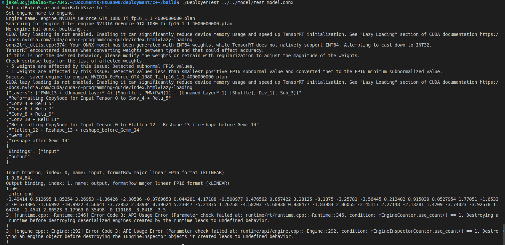
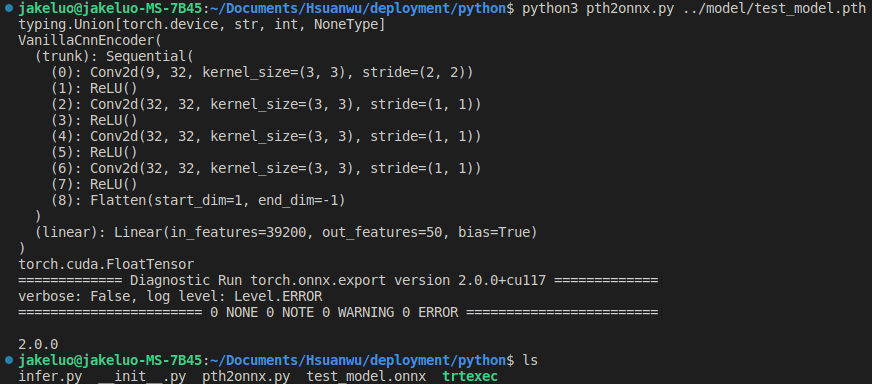
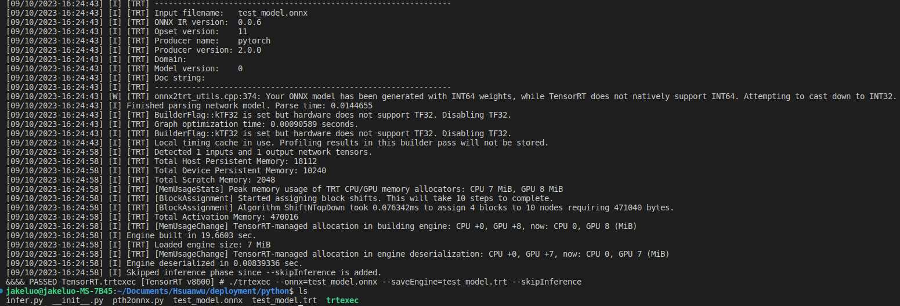
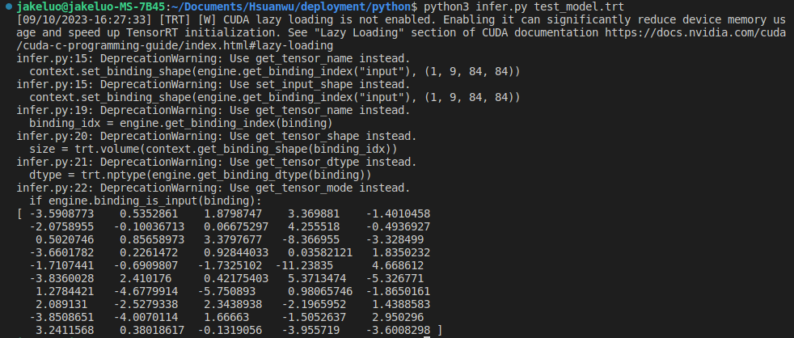
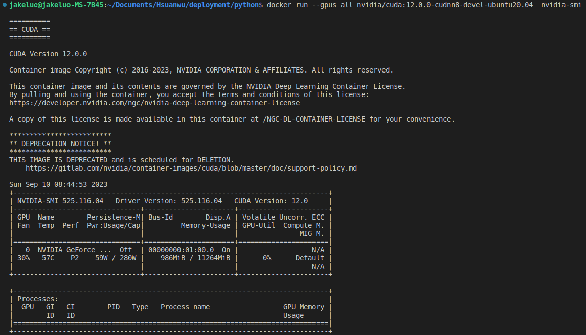
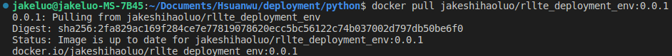
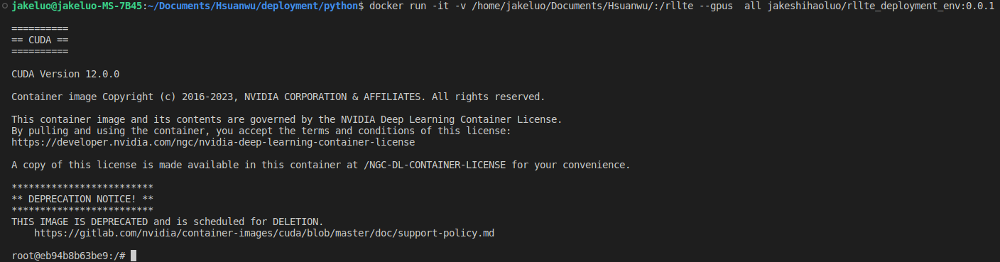
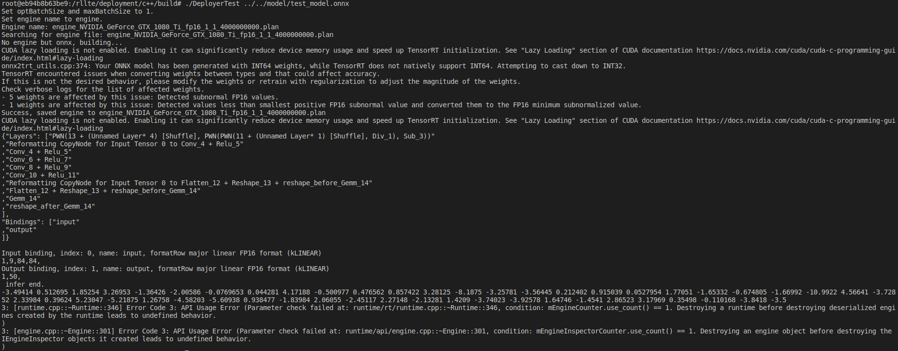
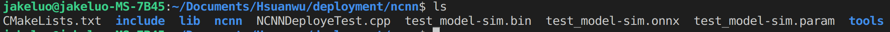
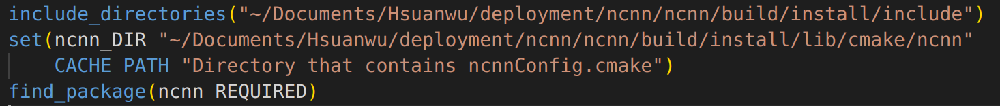

# HOW TO USE

## quick start
### requirements
#### necessary
>+ CUDA Toolkit Documentation v12.0: https://docs.nvidia.com/cuda/archive/12.0.0/cuda-installation-guide-linux/index.html  
>+ cuDNN v8.8.0 for CUDA 12.0:https://docs.nvidia.com/deeplearning/cudnn/install-guide/index.html  
>+ TensorRT 8.6.0 EA: https://docs.nvidia.com/deeplearning/tensorrt/archives/tensorrt-860-ea/quick-start-guide/index.html    

#### optional: python 
>+ pycuda 2022.2.2
>+ tensorrt 8.6.0
>+ numpy 1.24.2
>+ torch 1.10.2
>+ onnx 1.14.0

### c++
>+ `git clone https://github.com/RLE-Foundation/rllte`  
>+ `cd path_to_rllte/deloyment/c++`  
>+ `mkdir build && cd build`
>+ `cmake .. && make`
>+ `./DeployerTest ../../model/test_model.onnx`    
This demo will deploy the testing onnx model into tensorRT and output the performed result w.r.t the input [1\*9\*84\*84] float16 data.  

### python
>+ `git clone https://github.com/RLE-Foundation/rllte`    
>+ `cd path_to_rllte/deloyment/python`  
>+ `python3 pth2onnx.py ../model/test_model.pth`    
This python script will transform pth model to onnx model, which is saved in the current path.     
    
>+ `./trtexec --onnx=test_model.onnx --saveEngine=test_model.trt --skipInference`  
Using the trtexec tool to transfom the onnx model into trt model.   
    
>+ `python3 infer.py test_model.trt`  
It will infer the trt model and output the performed result w.r.t the input [1\*9\*84\*84] float16 data.  
 

## use in your c++ project
### basic API instruction
>+ `#inlude "RLLTEDeployer.h"`  
    Including the header file in your cpp file.  
>+ `Options options;`  
    `options.deviceIndex = 0;`  
    `options.doesSupportDynamicBatchSize = false;`  
    `options.maxWorkspaceSize = 4000000000;`  
    `options.precision = Precision::FP16;`  
    Declear an instance of Options, and configurate the parameters.
>+ `RLLTEDeployer deployer(options);`  
    Declear an instance of RLLTEDeployer.  
>+ `deployer.build(path_of_onnx_model)`  
    Use the build member function to convert the onnx model to the tensorrt static model(plan).
>+ `deployer.loadPlan()`   
    `deployer.loadPlan(path_of_the_tensortrt_plan)`   
    Use the loadPlan member function to load the converted model. If a path is given, then it will search the path, or it will just search the current working directory.
>+ `deployer.infer<float>(input, output, 1);`   
   `deployer.infer<float16_t>(input, output, 1);`   
   `deployer.infer<int8>(input, output, 1);`  
   Use infer member funtion to execute the infer process. The input is the tensor with relevant data type, and the output is a pointer with relevant data size and data type. The infer result will be moved to the output.
>+ The complete code please refer to the DeployerTest.cpp;

### build your c++ project with cmake
>+ `find_package(CUDA REQUIRED)`  
Find the header and dynamic libraries of CUDA.  
>+ `include_directories(${CUDA_INCLUDE_DIRS} ${Path_of_RLLTEDeployer_h}})`   
Set the path of include files required.
>+ `add_library(RLLTEDeployer SHARED ${Path_of_RLLTEDeployer.cpp} ${Path_of_common/logger.cpp})`
Build the RLLTEDployer as a dynamic library.  
>+ `target_link_libraries(RLLTEDeployer nvinfer nvonnxparser ${CUDA_LIBRARIES})`   
Link the dependecies od RLLTEDployer.so.  
>+ `add_executable(YourProjectExecutable ${Path_of_YourProjectExecutable.cpp})`  
Build the executable file of your project.  
>+ `target_link_libraries(YourProjectExecutable RLLTEDeployer)`  
Link the RLLTEDeployer to your project.  

## c++ deployment with Docker
Using docker to deploy model is easier than using host PC, the nvidia driver is the only dependency to install, everything else is prepared in the image.  
### install Nvidia_Docker
>+ Make sure to install Nvidia Driver.
>+ `sudo apt-get install ca-certificates gnupg lsb-release`
>+ `sudo mkdir -p /etc/apt/keyrings`
>+ `curl -fsSL https://download.docker.com/linux/ubuntu/gpg | sudo gpg --dearmor -o /etc/apt/keyrings/docker.gpg`
>+ `echo "deb [arch=$(dpkg --print-architecture) signed-by=/etc/apt/keyrings/docker.gpg] https://download.docker.com/linux/ubuntu $(lsb_release -cs) stable" | sudo tee /etc/apt/sources.list.d/docker.list > /dev/null`
>+ `sudo apt-get update`
>+ `sudo apt-get install docker-ce docker-ce-cli containerd.io docker-compose-plugin`
>+ `distribution=$(. /etc/os-release;echo $ID$VERSION_ID)`
>+ `curl -s -L https://nvidia.github.io/nvidia-docker/gpgkey | sudo apt-key add -`
>+ `curl -s -L https://nvidia.github.io/nvidia-docker/$distribution/nvidia-docker.list | sudo tee /etc/apt/sources.list.d/nvidia-docker.list`
>+ `sudo apt-get update && sudo apt-get install -y nvidia-container-toolkit`
>+ `sudo systemctl restart docker`
>+ `sudo groupadd docker`  
>+ `sudo gpasswd -a $USER docker`  
>+ Logout and Login to make the user group activated.
>+ `sudo service docker restart`  
>+ `docker run --gpus all nvidia/cuda:12.0.0-cudnn8-devel-ubuntu20.04  nvidia-smi`  
If the gpu message is showed, then everything is okay.  
 

### usage
>+ `docker pull jakeshihaoluo/rllte_deployment_env:0.0.1`  
 
>+ `docker run -it -v ${path_to_the_repo}:/rllte --gpus all jakeshihaoluo/rllte_deployment_env:0.0.1`  
 
>+ `cd /rllte/deloyment/c++`  
>+ `mkdir build && cd build`
>+ `cmake .. && make`
>+ `./DeployerTest ../../model/test_model.onnx`  
 

##  deployment with Ascend

### installation environment of Ascend
> Ref: https://www.hiascend.com/document/detail/en/CANNCommunityEdition/600alphaX/softwareinstall/instg/atlasdeploy_03_0004.html  

### development workflow 
> AscendCL provides a collection of C language APIs for use in the development of DNN inference apps on Compute Architecture for Neural Networks (CANN). These APIs are designed for model and operator loading and execution, as well as media data processing, facilitating deep learning inference computing, graphics and image preprocessing, and single-operator accelerated computing on the Ascend CANN platform.  

### prepares model
>+ Ref: https://www.hiascend.com/document/detail/en/CANNCommunityEdition/600alphaX/infacldevg/atctool/atctool_0003.html
>+ Take Ascend310 as example: `atc --model=model/test_model.onnx --framework=5 --output=test_model --input_format=NCHW --log=info --soc_version=Ascend310 --input_shape="input:1,9,84,84"`

### c++ development 
>+ include header file `#include "acl/acl.h"`  
>+ The main workflow is showned as below. The main functions are implemented in the *ascend/src/main.cpp* .  

### build and run
>+ `cd ascend`
>+ `export APP_SOURCE_PATH=<path_to_rllte_deployment>/ascend`
>+ `export DDK_PATH=<path_to_ascend_toolkit>`
>+ `export NPU_HOST_LIB=<path_to_ascend_devlib>`
>+ `chmod +x sample_build.sh`
>+ `./sample_build.sh`
>+ `./chmod +x sample_run.sh`
>+ `./sample_run.sh`

##  deployment with NCNN

### what is NCNN
>+ ncnn is a high-performance neural network inference computing framework optimized for mobile platforms. ncnn is deeply considerate about deployment and uses on mobile phones from the beginning of design. ncnn does not have third party dependencies. It is cross-platform, and runs faster than all known open source frameworks on mobile phone cpu. Developers can easily deploy deep learning algorithm models to the mobile platform by using efficient ncnn implementation, create intelligent APPs, and bring the artificial intelligence to your fingertips. ncnn is currently being used in many Tencent applications, such as QQ, Qzone, WeChat, Pitu and so on.  
Ref: https://github.com/Tencent/ncnn   
   

### deployment on PC with NCNN
>+ `cd deployment/ncnn`  
>+ install requirements of NCNN  
`sudo apt install build-essential git cmake libprotobuf-dev protobuf-compiler libvulkan-dev vulkan-utils libopencv-dev`  
>+ your onnx model may contains many redundant operators such as Shape, Gather and Unsqueeze that is not supported in ncnn. Use handy tool developed by daquexian to eliminate them.   
Ref:https://github.com/daquexian/onnx-simplifier  
`python3 -m pip install onnxsim`  
`python3 -m onnxsim ../model/test_model.onnx test_model-sim.onnx`   
>+ convert the model to ncnn using tools/onnx2ncnn    
`./tools/onnx2ncnn test_model-sim.onnx test_model-sim.param test_model-sim.bin`  
>+ now, you should have test_model-sim.bin  test_model-sim.onnx  test_model-sim.param in the ncnn directory.   
  
>+ before compile the executable, change the ncnn lib directory to your own path int the CMakeLists.txt, for example  
  
`mkdir build && cd build && cmake .. && make`  
`./NCNNDeployTest ../test_model-sim.param ../test_model-sim.bin `  
>+ After running it, it will output a 1*50 tensor.   
  

