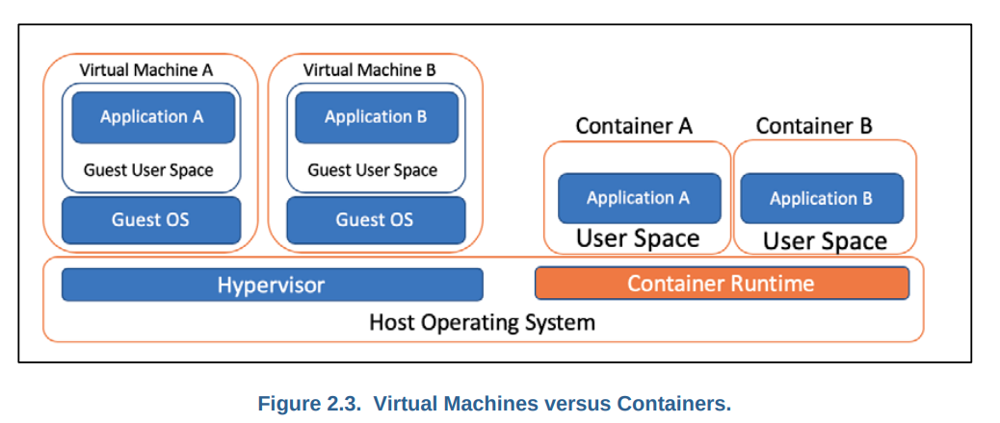
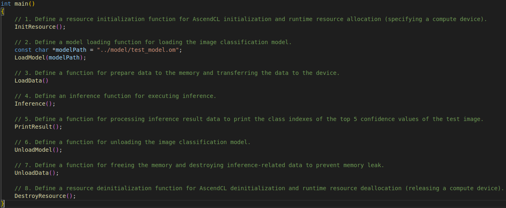

# HOW TO USE

## quick start
### requirements
#### necessary
>+ CUDA Toolkit Documentation v12.0: https://docs.nvidia.com/cuda/archive/12.0.0/cuda-installation-guide-linux/index.html  
>+ cuDNN v8.8.0 for CUDA 12.0:https://docs.nvidia.com/deeplearning/cudnn/install-guide/index.html  
>+ TensorRT 8.6.0 EA: https://docs.nvidia.com/deeplearning/tensorrt/archives/tensorrt-860-ea/quick-start-guide/index.html    

#### optional: python 
>+ pycuda 2022.2.2
>+ tensorrt 8.6.0
>+ numpy 1.24.2
>+ torch 1.10.2
>+ onnx 1.14.0

### c++
>+ `git clone https://github.com/RLE-Foundation/rllte`  
>+ `cd path_to_rllte/deloyment/c++`  
>+ `mkdir build && cd build`
>+ `cmake .. && make`
>+ `./DeployerTest ../../model/test_model.onnx`  

### python
>+ `git clone https://github.com/RLE-Foundation/rllte`  
>+ `cd path_to_rllte/deloyment/python`
>+ `python3 pth2onnx.py ../model/test_model.pth`
>+ `./trtexec --onnx=test_model.onnx --saveEngine=test_model.trt --skipInference`
>+ `python3 infer.py test_model.plan`

## use in your c++ project
>+ `#inlude "RLLTEDeployer.h"`  
    Including the header file in your cpp file.
>+ `Options options;`  
    `options.deviceIndex = 0;`  
    `options.doesSupportDynamicBatchSize = false;`  
    `options.maxWorkspaceSize = 4000000000;`  
    `options.precision = Precision::FP16;`  
    Declear an instance of Options, and configurate the parameters.
>+ `RLLTEDeployer deployer(options);`  
    Declear an instance of RLLTEDeployer.  
>+ `deployer.build(path_of_onnx_model)`  
    Use the build member function to convert the onnx model to the tensorrt static model(plan).
>+ `deployer.loadPlan()`   
    `deployer.loadPlan(path_of_the_tensortrt_plan)`   
    Use the loadPlan member function to load the converted model. If a path is given, then it will search the path, or it will just search the current working directory.
>+ `deployer.infer<float>(input, output, 1);`   
   `deployer.infer<float16_t>(input, output, 1);`   
   `deployer.infer<int8>(input, output, 1);`  
   Use infer member funtion to execute the infer process. The input is the tensor with relevant data type, and the output is a pointer with relevant data size and data type. The infer result will be moved to the output.
>+ The complete code please refer to the DeployerTest.cpp;

## c++ project with cmake
>+ `find_package(CUDA REQUIRED)`  
>+ `include_directories(${CUDA_INCLUDE_DIRS} ${Path_of_RLLTEDeployer_h}})`   
>+ `target_link_libraries(YOUREXECUTEFILE ${PATH_OF_libRLLTEDeployer_so)`  

## c++ deployment with Docker

### install Nvidia_Docker
>+ Make sure to install Nvidia Driver.
>+ `sudo apt-get install ca-certificates gnupg lsb-release`
>+ `sudo mkdir -p /etc/apt/keyrings`
>+ `curl -fsSL https://download.docker.com/linux/ubuntu/gpg | sudo gpg --dearmor -o /etc/apt/keyrings/docker.gpg`
>+ `echo "deb [arch=$(dpkg --print-architecture) signed-by=/etc/apt/keyrings/docker.gpg] https://download.docker.com/linux/ubuntu $(lsb_release -cs) stable" | sudo tee /etc/apt/sources.list.d/docker.list > /dev/null`
>+ `sudo apt-get update`
>+ `sudo apt-get install docker-ce docker-ce-cli containerd.io docker-compose-plugin`
>+ `distribution=$(. /etc/os-release;echo $ID$VERSION_ID)`
>+ `curl -s -L https://nvidia.github.io/nvidia-docker/gpgkey | sudo apt-key add -`
>+ `curl -s -L https://nvidia.github.io/nvidia-docker/$distribution/nvidia-docker.list | sudo tee /etc/apt/sources.list.d/nvidia-docker.list`
>+ `sudo apt-get update && sudo apt-get install -y nvidia-container-toolkit`
>+ `sudo systemctl restart docker`
>+ `sudo groupadd docker`  
>+ `sudo gpasswd -a $USER docker`  
>+ Logout and Login to make the user group activated.
>+ `sudo service docker restart`

### usage
>+ `docker pull jakeshihaoluo/rllte_deployment_env:0.0.1`
>+ `docker run -it -v ${path_to_the_repo}:/rllte --gpus all jakeshihaoluo/rllte_deployment_env:0.0.1`  
>+ `cd /rllte/deloyment/c++`  
>+ `mkdir build && cd build`
>+ `cmake .. && make`
>+ `./DeployerTest ../../model/test_model.onnx`  

##  deployment with Ascend

### installation environment of Ascend
> Ref: https://www.hiascend.com/document/detail/en/CANNCommunityEdition/600alphaX/softwareinstall/instg/atlasdeploy_03_0004.html  

### development workflow 
> AscendCL provides a collection of C language APIs for use in the development of DNN inference apps on Compute Architecture for Neural Networks (CANN). These APIs are designed for model and operator loading and execution, as well as media data processing, facilitating deep learning inference computing, graphics and image preprocessing, and single-operator accelerated computing on the Ascend CANN platform.  

### prepares model
>+ Ref: https://www.hiascend.com/document/detail/en/CANNCommunityEdition/600alphaX/infacldevg/atctool/atctool_0003.html
>+ Take Ascend310 as example: `atc --model=model/test_model.onnx --framework=5 --output=test_model --input_format=NCHW --log=info --soc_version=Ascend310 --input_shape="input:1,9,84,84"`

### c++ development 
>+ include header file `#include "acl/acl.h"`  
>+ The main workflow is showned as below. The main functions are implemented in the *ascend/src/main.cpp* .

### build and run
>+ `cd ascend`
>+ `export APP_SOURCE_PATH=<path_to_rllte_deployment>/ascend`
>+ `export DDK_PATH=<path_to_ascend_toolkit>`
>+ `export NPU_HOST_LIB=<path_to_ascend_devlib>`
>+ `chmod +x sample_build.sh`
>+ `./sample_build.sh`
>+ `./chmod +x sample_run.sh`
>+ `./sample_run.sh`