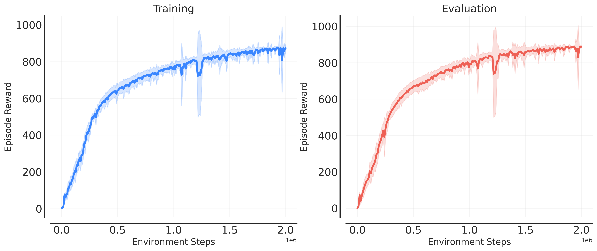

---
hide:
  - navigation
---

# RLLTE Hub: Large-Scale and Comprehensive Data Hub for RL
## Support list


| Benchmark | Algorithm | Remark | Reference |
|:-|:-|:-|:-|
|[Atari Games](https://www.jair.org/index.php/jair/article/download/10819/25823)|PPO|**10M**, 💯📊🤖|[Paper]() |
|[DeepMind Control (Pixel)](https://arxiv.org/pdf/1801.00690)|DrQ-v2|**1M**, 💯📊🤖|[Paper](https://arxiv.org/pdf/2107.09645.pdf?utm_source=morioh.com) |
|[DeepMind Control (State)](https://arxiv.org/pdf/1801.00690)|SAC|**10M for Humanoid, 2M else**, 💯📊🤖||
||DDPG|🐌||
|[Procgen Games](http://proceedings.mlr.press/v119/cobbe20a/cobbe20a.pdf)|PPO|**25M**, 💯📊🤖| [Paper](http://proceedings.mlr.press/v139/raileanu21a/raileanu21a.pdf) |
||DAAC|🐌| [Paper](http://proceedings.mlr.press/v139/raileanu21a/raileanu21a.pdf) |
|[MiniGrid Games](https://github.com/Farama-Foundation/Minigrid)|🐌|🐌|🐌|

!!! tip
    - **🐌**: Incoming.
    - **(25M)**: 25 million training steps.
    - **💯Scores**: Available final scores.
    - **📊Curves**: Available training curves.
    - **🤖Models**: Available trained models.

## Trained RL Models

The following example illustrates how to download an `PPO` agent trained the [Atari](https://envpool.readthedocs.io/en/latest/env/atari.html) benchmark:

``` py
from rllte.hub import Atari

agent = Atari().load_models(agent='ppo',
                            env_id='BeamRider-v5',
                            seed=0,
                            device='cuda')
print(agent)
```

Use the trained agent to play the game:
``` py
from rllte.env import make_envpool_atari_env
from rllte.common.utils import get_episode_statistics
import numpy as np

envs = make_envpool_atari_env(env_id="BeamRider-v5",
                              num_envs=1,
                              seed=0,
                              device="cuda",
                              asynchronous=False)

obs, infos = envs.reset(seed=0)
episode_rewards, episode_steps = list(), list()
while len(episode_rewards) < 10:
    # The agent outputs logits of the action distribution
    actions = th.softmax(agent(obs), dim=1).argmax(dim=1)
    obs, rewards, terminateds, truncateds, infos = envs.step(actions)

    eps_r, eps_l = get_episode_statistics(infos)
    episode_rewards.extend(eps_r)
    episode_steps.extend(eps_l)    

print(f"mean episode reward: {np.mean(episode_rewards)}")
print(f"mean episode length: {np.mean(episode_steps)}")

# Output:
# mean episode reward: 3249.8
# mean episode length: 3401.1
```

## RL Training Logs
Download training logs of various RL algorithms on well-recognized benchmarks for academic research. 

### Training Curves

The following example illustrates how to download training curves of the `SAC` agent on the [DeepMind Control Suite](https://github.com/google-deepmind/dm_control) benchmark:

``` py
from rllte.hub import DMControl

curves = DMControl().load_curves(agent='sac', env_id="cheetah_run")
```
This will return a Python `Dict` of NumPy array like:
```
curves
├── train: np.ndarray(shape=(N_SEEDS, N_POINTS))
└── eval:  np.ndarray(shape=(N_SEEDS, N_POINTS))
```

Visualize the training curves:
<div align="center">

</div>

### Test Scores

Similarly, download the final test scores via
``` py
scores = DMControl().load_scores(agent='sac', env_id="cheetah_run")
```
This will return a data array with shape `(N_SEEDS, N_POINTS)`.

## RL Training Applications
Developers can also train RL agents on well-recognized benchmarks rapidly using simple interfaces. Suppose we want to train an `PPO` agent on [Procgen](https://github.com/openai/procgen) benchmark, it suffices to write a `train.py` like:
``` py
from rllte.hub import Procgen

app = Procgen().load_apis(agent="PPO", env_id="coinrun", seed=1, device="cuda")
app.train(num_train_steps=2.5e+7)
```
All the curves, scores, and models were trained via `.load_apis()`, and all the hyper-parameters can be found in the reference of the support list.
