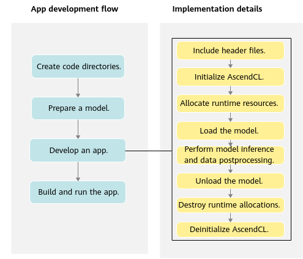

# with CANN

AscendCL provides a collection of C language APIs for use in the development of DNN inference apps on Compute Architecture for Neural Networks (CANN). These APIs are designed for model and operator loading and execution, as well as media data processing, facilitating deep learning inference computing, graphics and image preprocessing, and single-operator accelerated computing on the Ascend CANN platform.

<div align=center>

</div>

## Prerequisites
Get the complete repository from GitHub:
``` sh
git clone https://github.com/RLE-Foundation/rllte
```

Download and install the following necessary libraries:
[CANN 6.0.1](https://www.hiascend.com/document/detail/en/canncommercial/601/overview/index.html)

## Model preparation
Take Ascend310 for example:
``` sh
atc --model=model/test_model.onnx --framework=5 --output=test_model --input_format=NCHW --log=info --soc_version=Ascend310 --input_shape="input:1,9,84,84"
```
More details can be found in [Learning Wizard](https://www.hiascend.com/document/detail/en/CANNCommunityEdition/600alphaX/infacldevg/atctool/atctool_0003.html).

## C++ development
- Include the header file `#include "acl/acl.h"`
- The main workflow is 
``` c++
int main()
{	
    // 1. Define a resource initialization function for AscendCL initialization and runtime resource allocation (specifying a compute device).
	InitResource();
	
    // 2. Define a model loading function for loading the image classification model.
	const char *modelPath = "../model/test_model.om";
	LoadModel(modelPath);
	
    // 3. Define a function for prepare data to the memory and transferring the data to the device.
    LoadData()
	
    // 4. Define an inference function for executing inference.
	Inference();
	
    // 5. Define a function for processing inference result data to print the class indexes of the top 5 confidence values of the test image.
	PrintResult();
	
    // 6. Define a function for unloading the image classification model.
	UnloadModel();
	
    // 7. Define a function for freeing the memory and destroying inference-related data to prevent memory leak.
	UnloadData();
	
    // 8. Define a resource deinitialization function for AscendCL deinitialization and runtime resource deallocation (releasing a compute device).
	DestroyResource();
}
```

## Build and run
``` sh
cd ascend
export APP_SOURCE_PATH=<path_to_rllte_deployment>/ascend
export DDK_PATH=<path_to_ascend_toolkit>
export NPU_HOST_LIB=<path_to_ascend_devlib>
chmod +x sample_build.sh
./sample_build.sh
./chmod +x sample_run.sh
./sample_run.sh
```