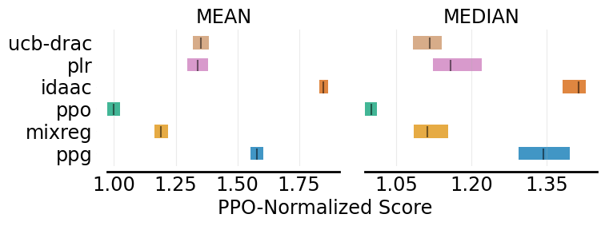
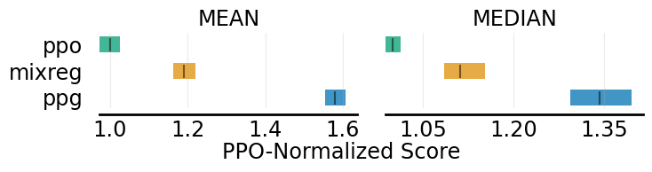
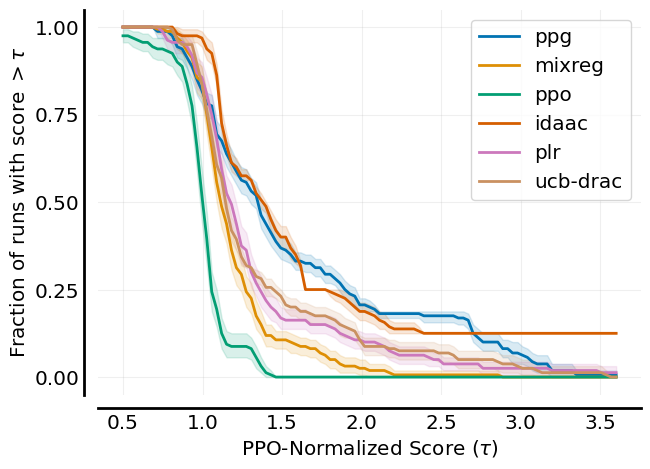

# Metrics Visualization

<div class="badge">
<a href="https://colab.research.google.com/github/RLE-Foundation/rllte/blob/main/examples/model_evaluation.ipynb">

Open in Colab
</a>
</div>

<div class="badge">
<a href="https://github.com/RLE-Foundation/rllte/blob/main/examples/model_evaluation.ipynb">

&nbsp;&nbsp;View on GitHub
</a>
</div>

## Download Data
Suppose we want to visualize algorithm performance on the [Procgen](https://github.com/openai/procgen) benchmark. First, download the data from 
[rllte-hub](https://hub.rllte.dev/):
``` py title="example.py"
# load packages
from rllte.evaluation import Performance, Comparison, min_max_normalize
from rllte.hub.datasets import Procgen, Atari
from rllte.evaluation import (plot_interval_estimates,
                              plot_probability_improvement,
                              plot_sample_efficiency_curve,
                              plot_performance_profile)
import numpy as np
# load scores
procgen = Procgen()
procgen_scores = procgen.load_scores()
print(procgen_scores.keys())
# get ppo-normalized scores
ppo_norm_scores = dict()
MIN_SCORES = np.zeros_like(procgen_scores['ppo'])
MAX_SCORES = np.mean(procgen_scores['ppo'], axis=0)
for algo in procgen_scores.keys():
    ppo_norm_scores[algo] = min_max_normalize(procgen_scores[algo],
                                              min_scores=MIN_SCORES,
                                              max_scores=MAX_SCORES)

# Output:
# dict_keys(['ppg', 'mixreg', 'ppo', 'idaac', 'plr', 'ucb-drac'])
```
For each algorithm, this will return a `NdArray` of size (`10` x `16`) where scores[n][m] represent the score on run `n` of task `m`.

## Visualization
### `.plot_interval_estimates`
`.plot_interval_estimates` can plot various performance metrics of algorithms with stratified confidence intervals. Take [Procgen](https://github.com/openai/procgen) for example, we want to plot four reliable metrics computed by `Performance` evaluator:
```py title="example.py"
# construct a performance dict
aggregate_performance_dict = {
    "MEAN": {},
    "MEDIAN": {},
    "IQM": {},
    "OG": {}
}
for algo in ppo_norm_scores.keys():
    perf = Performance(scores=ppo_norm_scores[algo], get_ci=True)
    aggregate_performance_dict['MEAN'][algo] = perf.aggregate_mean()
    aggregate_performance_dict['MEDIAN'][algo] = perf.aggregate_median()
    aggregate_performance_dict['IQM'][algo] = perf.aggregate_iqm()
    aggregate_performance_dict['OG'][algo] = perf.aggregate_og()

# plot all the four metrics of all the algorithms
fig, axes = plot_interval_estimates(aggregate_performance_dict,
                                    metric_names=['MEAN', 'MEDIAN', 'IQM', 'OG'],
                                    algorithms=['PPO', 'MixReg', 'UCB-DrAC', 'PLR', 'PPG', 'IDAAC'],
                                    xlabel="PPO-Normalized Score")
fig.savefig('./plot_interval_estimates1.png', format='png', bbox_inches='tight')

# plot two metrics of all the algorithms
fig, axes = plot_interval_estimates(aggregate_performance_dict,
                        metric_names=['MEAN', 'MEDIAN'],
                        algorithms=['PPO', 'MixReg', 'UCB-DrAC', 'PLR', 'PPG', 'IDAAC'],
                        xlabel="PPO-Normalized Score")
fig.savefig('./plot_interval_estimates2.png', format='png', bbox_inches='tight')

# plot two metrics of three algorithms
fig, axes = plot_interval_estimates(aggregate_performance_dict,
                        metric_names=['MEAN', 'MEDIAN'],
                        algorithms=['ppg', 'mixreg', 'ppo'],
                        xlabel="PPO-Normalized Score",
                        xlabel_y_coordinate=-0.4)
fig.savefig('./plot_interval_estimates3.png', format='png', bbox_inches='tight')
```
The output figures are:
<div align=center>



</div>


### `.plot_probability_improvement`
`.plot_probability_improvement` plots probability of improvement with stratified confidence intervals. An example is:
```py title="example.py"
# construct a comparison dict
pairs = [['IDAAC', 'PPG'], ['IDAAC', 'UCB-DrAC'], ['IDAAC', 'PPO'],
    ['PPG', 'PPO'], ['UCB-DrAC', 'PLR'], 
    ['PLR', 'MixReg'], ['UCB-DrAC', 'MixReg'],  ['MixReg', 'PPO']]

probability_of_improvement_dict = {}
for pair in pairs:
    comp = Comparison(scores_x=ppo_norm_scores[pair[0]], 
                      scores_y=ppo_norm_scores[pair[1]],
                      get_ci=True)
    probability_of_improvement_dict['_'.join(pair)] = comp.compute_poi()

fig, ax = plot_probability_improvement(poi_dict=probability_of_improvement_dict)
fig.savefig('./plot_probability_improvement.png', format='png', bbox_inches='tight')
```
The output figure is:
<div align=center>

</div>

### `.plot_performance_profile`
`.plot_performance_profile` plots performance profiles with stratified confidence intervals. An example is:
```py title="example.py"
profile_dict = dict()
procgen_tau = np.linspace(0.5, 3.6, 101)

for algo in ppo_norm_scores.keys():
    perf = Performance(scores=ppo_norm_scores[algo], get_ci=True, reps=2000)
    profile_dict[algo] = perf.create_performance_profile(tau_list=procgen_tau)

fig, axes = plot_performance_profile(profile_dict, 
                         procgen_tau,
                         figsize=(7, 5),
                         xlabel=r'PPO-Normalized Score $(\tau)$',
                         )
fig.savefig('./plot_performance_profile.png', format='png', bbox_inches='tight')
```
The output figure is:
<div align=center>

</div>

### `.plot_sample_efficiency_curve`
`.plot_sample_efficiency_curve` plots an aggregate metric with CIs as a function of environment frames. An example is:
```py title="example.py"
# get Atari games' curve data
ale_all_frames_scores_dict = Atari().load_curves()
print(ale_all_frames_scores_dict.keys())
print(ale_all_frames_scores_dict['C51'].shape)
# Output:
# dict_keys(['C51', 'DQN (Adam)', 'DQN (Nature)', 'Rainbow', 'IQN', 'REM', 'M-IQN', 'DreamerV2'])
# (5, 55, 200)
# 200 data points of 55 games over 5 random seeds

frames = np.array([1, 10, 25, 50, 75, 100, 125, 150, 175, 200]) - 1

sampling_dict = dict()
for algo in ale_all_frames_scores_dict.keys():
    sampling_dict[algo] = [[], [], []]
    for frame in frames:
        perf = Performance(ale_all_frames_scores_dict[algo][:, :, frame],
                           get_ci=True, 
                           reps=2000)
        value, CIs = perf.aggregate_iqm()
        sampling_dict[algo][0].append(value)
        sampling_dict[algo][1].append(CIs[0]) # lower bound
        sampling_dict[algo][2].append(CIs[1]) # upper bound
    
    sampling_dict[algo][0] = np.array(sampling_dict[algo][0]).reshape(-1)
    sampling_dict[algo][1] = np.array(sampling_dict[algo][1]).reshape(-1)
    sampling_dict[algo][2] = np.array(sampling_dict[algo][2]).reshape(-1)

algorithms = ['C51', 'DQN (Adam)', 'DQN (Nature)', 'Rainbow', 'IQN', 'REM', 'M-IQN', 'DreamerV2']
fig, axes = plot_sample_efficiency_curve(
    sampling_dict,
    frames+1, 
    figsize=(7, 4.5),
    algorithms=algorithms,
    xlabel=r'Number of Frames (in millions)',
    ylabel='IQM Human Normalized Score')
fig.savefig('./plot_sample_efficiency_curve.png', format='png', bbox_inches='tight')
```
The output figure is:
<div align=center>

</div>