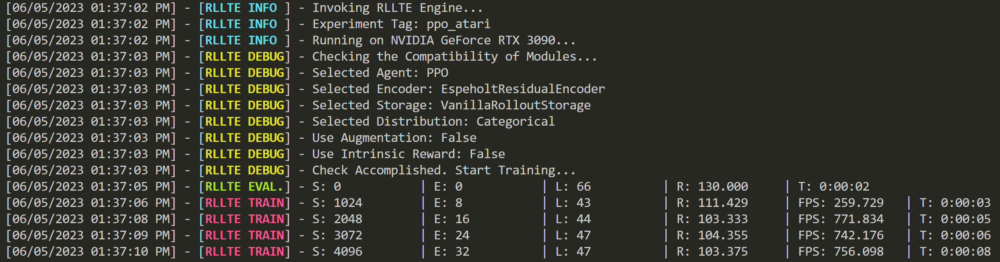

# Decoupling Algorithms by Module Replacement

## Decoupling Algorithms
The actual performance of an RL algorithm is affected by various factors (e.g., different network architectures and experience usage 
strategies), which are difficult to quantify.

> Huang S, Dossa R F J, Raffin A, et al. The 37 Implementation Details of Proximal Policy Optimization[J]. The ICLR Blog Track 2023, 2022.

To address the problem, **rllte** has achieved complete decoupling of RL algorithms, and you can replace the following five parts using built-in or customized modules:

- **Encoder**: Moudles for processing observations and extracting features.
- **Storage**: Modules for storing and replaying collected experiences.
- **Distribution**: Modules for sampling actions.
- **Augmentation**: Modules for observations augmentation.
- **Reward**: Intrinsic reward modules for enhancing exploration.

!!! info
    Despite **rllte** supports module replacement, it is not **mandatory** and will not affect the use of native algorithms.

## Module Replacement
For instance, we want to use [PPO](https://arxiv.org/pdf/1707.06347) agent to solve [Atari](https://www.jair.org/index.php/jair/article/download/10819/25823) games, it suffices to write `train.py` like:
``` py title="train.py"
from rllte.xploit.agent import PPO
from rllte.env import make_atari_env

if __name__ == "__main__":
    # env setup
    device = "cuda:0"
    env = make_atari_env(device=device)
    eval_env = make_atari_env(device=device)
    # create agent
    agent = PPO(env=env, 
                eval_env=eval_env, 
                device=device,
                tag="ppo_atari")
    # start training
    agent.train(num_train_steps=5000)
```
Run `train.py` and you'll see the following output:
<div align=center>

</div>

Suppose we want to use a `ResNet-based` encoder, it suffices to replace the encoder module using `.set` function:
``` py title="train.py"
from rllte.xploit.agent import PPO
from rllte.env import make_atari_env
from rllte.xploit.encoder import EspeholtResidualEncoder

if __name__ == "__main__":
    # env setup
    device = "cuda:0"
    env = make_atari_env(device=device)
    eval_env = make_atari_env(device=device)
    # create agent
    feature_dim = 512
    agent = PPO(env=env, 
                eval_env=eval_env, 
                device=device,
                tag="ppo_atari",
                feature_dim=feature_dim)
    # create a new encoder
    encoder = EspeholtResidualEncoder(
        observation_space=env.observation_space,
        feature_dim=feature_dim)
    # set the new encoder
    agent.set(encoder=encoder)
    # start training
    agent.train(num_train_steps=5000)
```
Run `train.py` and you'll see the old `MnihCnnEncoder` has been replaced by `EspeholtResidualEncoder`:
<div align=center>

</div>
For more replaceable modules, please refer to [https://docs.rllte.dev/api/](https://docs.rllte.dev/api/).

## Using Custom Modules
**rllte** is an open platform that supports custom modules. Just write a new module based on the `BaseClass`, then we can 
insert it into an agent directly. Suppose we want to build a new encoder entitled `NewEncoder`. An example is
```py title="example.py"
from rllte.xploit.agent import PPO
from rllte.env import make_atari_env
from rllte.common.base_encoder import BaseEncoder
from gymnasium.spaces import Space
from torch import nn
import torch as th

class CustomEncoder(BaseEncoder):
    """Custom encoder.
    
    Args:
        observation_space (Space): The observation space of environment.
        feature_dim (int): Number of features extracted.

    Returns:
        The new encoder instance.
    """
    def __init__(self, observation_space: Space, feature_dim: int = 0) -> None:
        super().__init__(observation_space, feature_dim)

        obs_shape = observation_space.shape
        assert len(obs_shape) == 3

        self.trunk = nn.Sequential(
            nn.Conv2d(obs_shape[0], 32, 3, stride=2), nn.ReLU(),
            nn.Conv2d(32, 32, 3, stride=2), nn.ReLU(),
            nn.Flatten(),
        )

        with th.no_grad():
            sample = th.ones(size=tuple(obs_shape)).float()
            n_flatten = self.trunk(sample.unsqueeze(0)).shape[1]

        self.trunk.extend([nn.Linear(n_flatten, feature_dim), nn.ReLU()])

    def forward(self, obs: th.Tensor) -> th.Tensor:
        h = self.trunk(obs / 255.0)

        return h.view(h.size()[0], -1)

if __name__ == "__main__":
    # env setup
    device = "cuda:0"
    env = make_atari_env(device=device)
    eval_env = make_atari_env(device=device)
    # create agent
    feature_dim = 512
    agent = PPO(env=env, 
                eval_env=eval_env, 
                device=device,
                tag="ppo_atari",
                feature_dim=feature_dim)
    # create a new encoder
    encoder = CustomEncoder(observation_space=env.observation_space, 
                         feature_dim=feature_dim)
    # set the new encoder
    agent.set(encoder=encoder)
    # start training
    agent.train(num_train_steps=5000)
```
Run `example.py` and you'll see the old `MnihCnnEncoder` has been replaced by `CustomEncoder`:
<div align=center>

</div>
As for customizing modules like `Storage` and `Distribution`, etc., users should consider compatibility with specific algorithms.