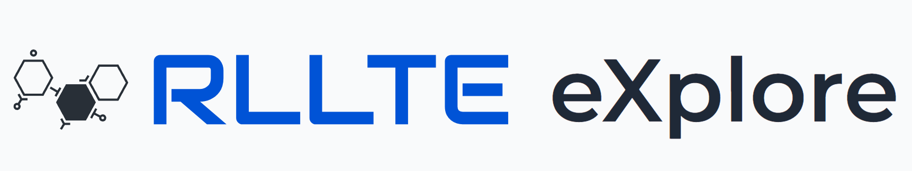

# Intrinsic Reward Shaping for Enhancing Exploration

<div class="badge">
<a href="https://colab.research.google.com/github/RLE-Foundation/RLeXplore/blob/main/0%20quick_start.ipynb">

Open in Colab
</a>
</div>

<div class="badge">
<a href="https://github.com/RLE-Foundation/RLeXplore/blob/main/0%20quick_start.ipynb">

View on GitHub
</a>
</div>


<div align=center>
<br>

<br>
</div>

## Introduction

Since **RLLTE** decouples RL algorithms into minimum primitives from the perspective of exploitation and exploration, intrinsic reward shaping is supported by default. **RLLTE eXplore (RLeXplore)** is a unified, highly-modularized and plug-and-play toolkit that currently provides high-quality and reliable implementations of eight representative intrinsic reward algorithms. It used to be challenging to compare intrinsic reward algorithms due to various confounding factors, including distinct implementations, optimization strategies, and evaluation methodologies. Therefore, RLeXplore is designed to provide unified and standardized procedures for constructing, computing, and optimizing intrinsic reward modules.

The workflow of RLeXplore is illustrated as follows:
<div align=center>

</div>

Commonly, at each time step, the agent receives observations from the environment and predicts actions. The environment then executes the actions and returns feedback to the agent, which consists of a next observation, a reward, and a terminal signal. During the data collection process, the ***.watch()*** function is used to monitor the agent-environment interactions. For instance, E3B [1] updates an estimate of an ellipsoid in an embedding space after observing every state. At the end of the data collection rollouts, ***.compute()*** computes the corresponding intrinsic rewards. Note that ***.compute()*** is only called once per rollout using batched operations, which makes RLeXplore a highly efficient framework. Additionally, RLeXplore provides several utilities for reward and observation normalization. Finally, the ***.update()*** function is called immediately after ***.compute()*** to update the reward module if necessary (e.g., train the forward dynamics models in Disagreement [2] or the predictor network in RND [3]). All operations are subject to the standard workflow of the Gymnasium API. 

``` 
[1] Henaff M, Raileanu R, Jiang M, et al. Exploration via elliptical episodic bonuses[J]. Advances in Neural Information Processing Systems, 2022, 35: 37631-37646.
[2] Pathak D, Agrawal P, Efros A A, et al. Curiosity-driven exploration by self-supervised prediction[C]//International conference on machine learning. PMLR, 2017: 2778-2787.
[3] Burda Y, Edwards H, Storkey A, et al. Exploration by random network distillation[C]//Seventh International Conference on Learning Representations. 2019: 1-17.
```

## Workflow


- First, load the intrinsic module from **RLLTE** and other libraries:
``` python
import gymnasium as gym
import numpy as np
import torch as th

from rllte.env.utils import Gymnasium2Torch
from rllte.xplore.reward import ICM
```

- Second, create a fake Atari environment with image observations:
``` python
class FakeAtari(gym.Env):
    def __init__(self):
        self.action_space = gym.spaces.Discrete(7)
        self.observation_space = gym.spaces.Box(low=0, high=1, shape=(4, 84, 84))
        self.count = 0

    def reset(self):
        self.count = 0
        return self.observation_space.sample(), {}

    def step(self, action):
        self.count += 1
        if self.count > 100 and np.random.rand() < 0.1:
            term = trunc = True
        else:
            term = trunc = False
        return self.observation_space.sample(), 0, term, trunc, {}
```

- Record the transitions data via ***.watch()*** and compute the intrinsic rewards via ***.compute()***:
``` python
# set the parameters
device = 'cuda' if th.cuda.is_available() else 'cpu'
n_steps = 128
n_envs = 8
# create the vectorized environments
envs = gym.vector.AsyncVectorEnv([FakeAtari for _ in range(n_envs)])
# wrap the environments to convert the observations to torch tensors
envs = Gymnasium2Torch(envs, device)
# create the intrinsic reward module
irs = ICM(envs, device)
# reset the environments and get the initial observations
obs, infos = envs.reset()
# create a dictionary to store the samples
samples = {'observations':[], 
           'actions':[], 
           'rewards':[],
           'terminateds':[],
           'truncateds':[],
           'next_observations':[]}
# sampling loop
for _ in range(n_steps):
    # sample random actions
    actions = th.stack([th.as_tensor(envs.action_space.sample()) for _ in range(n_envs)])
    # environment step
    next_obs, rewards, terminateds, truncateds, infos = envs.step(actions)
    # watch the interactions and get necessary information for the intrinsic reward computation
    irs.watch(observations=obs, 
              actions=actions, 
              rewards=rewards,
              terminateds=terminateds,
              truncateds=truncateds,
              next_observations=next_obs)
    # store the samples
    samples['observations'].append(obs)
    samples['actions'].append(actions)
    samples['rewards'].append(rewards)
    samples['terminateds'].append(terminateds)
    samples['truncateds'].append(truncateds)
    samples['next_observations'].append(next_obs)
    obs = next_obs
# compute the intrinsic rewards
samples = {k: th.stack(v) for k, v in samples.items()}
intrinsic_rewards = irs.compute(samples=samples)
print(intrinsic_rewards)
print(intrinsic_rewards.shape)

# Output:
# tensor([[6.5928, 5.5006, 5.3346,  ..., 5.3286, 6.5831, 5.1960],
#         [3.4611, 3.4754, 5.3265,  ..., 4.9442, 5.3422, 3.7767],
#         [3.7612, 3.7736, 6.5909,  ..., 3.7735, 4.9679, 6.5922],
#         ...,
#         [3.4737, 4.9781, 6.5358,  ..., 5.2204, 5.3287, 6.5794],
#         [3.7659, 5.3463, 5.3620,  ..., 6.5735, 5.3437, 3.7666],
#         [5.4956, 4.9599, 5.3435,  ..., 6.5689, 5.2174, 3.7587]],
#        device='cuda:0')
# torch.Size([128, 8])
```
In this example, `Synchronous Mode` is used, in which the ***.update()*** will be automatically invoked in the ***.compute()*** function, usually for on-policy RL algorithms. For off-policy RL algorithms, we need to use the `Asynchronous Mode` and invoke the ***.update()*** separately:
``` python
# set the parameters
device = 'cuda' if th.cuda.is_available() else 'cpu'
n_steps = 128
n_envs = 8
# create the vectorized environments
envs = gym.vector.AsyncVectorEnv([FakeAtari for _ in range(n_envs)])
# wrap the environments to convert the observations to torch tensors
envs = Gymnasium2Torch(envs, device)
# create the intrinsic reward module
irs = ICM(envs, device)
# reset the environments and get the initial observations
obs, infos = envs.reset()
# create a dictionary to store the samples
samples = {'observations':[], 
           'actions':[], 
           'rewards':[],
           'terminateds':[],
           'truncateds':[],
           'next_observations':[]}
# sampling loop
for _ in range(n_steps):
    # sample random actions
    actions = th.stack([th.as_tensor(envs.action_space.sample()) for _ in range(n_envs)])
    # environment step
    next_obs, rewards, terminateds, truncateds, infos = envs.step(actions)
    # watch the interactions and get necessary information for the intrinsic reward computation
    irs.watch(observations=obs, 
              actions=actions, 
              rewards=rewards,
              terminateds=terminateds,
              truncateds=truncateds,
              next_observations=next_obs)
    # compute the intrinsic rewards at each step
    intrinsic_rewards = irs.compute(samples={'observations':obs.unsqueeze(0), 
                                            'actions':actions.unsqueeze(0), 
                                            'rewards':rewards.unsqueeze(0),
                                            'terminateds':terminateds.unsqueeze(0),
                                            'truncateds':truncateds.unsqueeze(0),
                                            'next_observations':next_obs.unsqueeze(0)}, 
                                            sync=False)
    print(intrinsic_rewards, intrinsic_rewards.shape)
    # store the samples
    samples['observations'].append(obs)
    samples['actions'].append(actions)
    samples['rewards'].append(rewards)
    samples['terminateds'].append(terminateds)
    samples['truncateds'].append(truncateds)
    samples['next_observations'].append(next_obs)
    obs = next_obs
# update the intrinsic reward module
samples = {k: th.stack(v) for k, v in samples.items()}
irs.update(samples=samples)
```


## RLeXplore with RLLTE
In **RLLTE**, you can also invoke the intrinsic reward module in all the implemented algorithms directly by `.set` function:
``` py title="example.py"
from rllte.agent import PPO
from rllte.env import make_atari_env
from rllte.xplore.reward import RE3

if __name__ == "__main__":
    # env setup
    device = "cuda:0"
    envs = make_atari_env(device=device)
    # create agent
    agent = PPO(env=envs, 
                device=device,
                tag="ppo_atari")
    # create intrinsic reward
    re3 = RE3(envs=envs, device=device)
    # set the module
    agent.set(reward=re3)
    # start training
    agent.train(num_train_steps=5000)
```
Run `example.py` and you'll see the intrinsic reward module is invoked:
``` sh
[08/04/2023 03:54:10 PM] - [INFO.] - Invoking RLLTE Engine...
[08/04/2023 03:54:10 PM] - [INFO.] - ================================================================================
[08/04/2023 03:54:10 PM] - [INFO.] - Tag               : ppo_atari
[08/04/2023 03:54:10 PM] - [INFO.] - Device            : NVIDIA GeForce RTX 3090
[08/04/2023 03:54:11 PM] - [DEBUG] - Agent             : PPO
[08/04/2023 03:54:11 PM] - [DEBUG] - Encoder           : MnihCnnEncoder
[08/04/2023 03:54:11 PM] - [DEBUG] - Policy            : OnPolicySharedActorCritic
[08/04/2023 03:54:11 PM] - [DEBUG] - Storage           : VanillaRolloutStorage
[08/04/2023 03:54:11 PM] - [DEBUG] - Distribution      : Categorical
[08/04/2023 03:54:11 PM] - [DEBUG] - Augmentation      : False
[08/04/2023 03:54:11 PM] - [DEBUG] - Intrinsic Reward  : True, RE3
[08/04/2023 03:54:11 PM] - [DEBUG] - ================================================================================
```

## RLeXplore with Stable-baselines, CleanRL, ...
**RLeXplore** can be seamlessly integrated with existing RL libraries, such as Stable-Baselines3, CleanRL, etc. We provide specific examples on [GitHub](https://github.com/RLE-Foundation/RLeXplore#tutorials).

## Custom Intrinsic Reward
Since **RLeXplore** provides a standardized workflow and modular components of intrinsic rewards, which facilitates the creation, modification, and testing of new ideas. See the example of creating custom intrinsic rewards on [GitHub](https://github.com/RLE-Foundation/RLeXplore/blob/main/5%20custom_intrinsic_reward.ipynb).


## Benchmark Results
We conducted extensive experiments to evaluate the performance of **RLeXplore** on multiple well-recognized exploration tasks, such as *SuperMarioBros*, *MiniGrid*, etc. Please view our [Wandb](https://wandb.ai/yuanmingqi/RLeXplore/reportlist) space for the benchmark results.