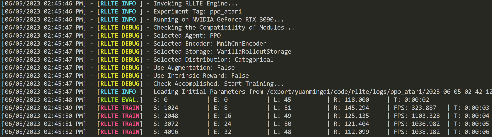

## Training Configuration
Currently, **rllte** only supports online pre-training via intrinsic reward. To turn on the pre-training mode, 
it suffices to write a `train.py` like:
```py title="train.py"
from rllte.agent import PPO
from rllte.env import make_atari_env
from rllte.xplore.reward import RE3

if __name__ == "__main__":
    # env setup
    device = "cuda:0"
    env = make_atari_env(device=device)
    eval_env = make_atari_env(device=device)
    # create agent and turn on pre-training mode
    agent = PPO(env=env, 
                eval_env=eval_env, 
                device=device,
                tag="ppo_atari",
                pretraining=True)
    # create intrinsic reward
    re3 = RE3(observation_space=env.observation_space,
              action_space=env.action_space,
              device=device)
    # set the new encoder
    agent.set(reward=re3)
    # start training
    agent.train(num_train_steps=5000)
```
Run `train.py` and you'll see the pre-training mode is on:
<div align=center>

</div>

!!! tip
    When the pre-training mode is on, a `reward` module must be specified!
    
For all supported reward modules, see [API Documentation](https://docs.rllte.dev/api/).

## Fine-tuning
Once the pre-training is finished, you can find the model parameters in the `pretrained` subfolder of the working directory. To 
load the parameters, just turn off the pre-training mode and write the `train.py` like

```py title="train.py"
from rllte.agent import PPO
from rllte.env import make_atari_env

if __name__ == "__main__":
    # env setup
    device = "cuda:0"
    env = make_atari_env(device=device)
    eval_env = make_atari_env(device=device)
    # create agent and turn off pre-training mode
    agent = PPO(env=env, 
                eval_env=eval_env, 
                device=device,
                tag="ppo_atari",
                pretraining=False)
    # start training
    agent.train(num_train_steps=5000,
                init_model_path="/export/yuanmingqi/code/rllte/logs/ppo_atari/2023-06-05-02-42-12/pretrained/pretrained.pth")
```
Run `train.py` and you'll see the pre-trained model parameters are loaded:
<div align=center>

</div>