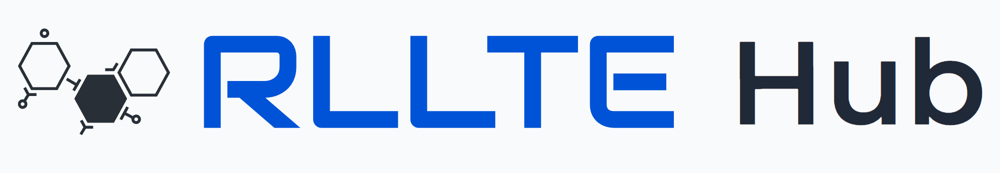

<div align=center>
<br>

<br>

RLLTE Hub: Large-Scale and Comprehensive Data Hub for Reinforcement Learning
</div>

# Contents
- [Overview](#overview)
- [Installation](#installation)
- [We Provide](#we-provide)
  - [Trained RL Models](#trained-rl-models)
  - [RL Training Logs](#rl-training-logs)
    - [Training Curves](#training-curves)
    - [Test Scores](#test-scores)
  - [RL Training Applications](#rl-training-applications)
- [Cite the Project](#cite-the-project)

# Overview
**RLLTE Hub** is a repository of multifarious trained models and datasets of reinforcement learning (RL). The following table illustrates its architecture:

| **Module** | **Function**|
|:--|:--|
| `rllte.hub.***`|📊 `.load_curves`: Load learning curves of an RL algorithm on a task.|
||💯 `.load_scores`: Load test scores of an RL algorithm on a task.|
||🗃️ `.load_models`: Load a trained RL agent on a task.|
||🎮 `.load_apis`: Load a training API.|

A complete support list for RL algorithms and environments can be found in [https://docs.rllte.dev/hub](https://docs.rllte.dev/hub).

# Installation
Developers can invoke the `hub` module in `rllte` directly. Open a terminal and install `rllte` with `pip`:
```
pip install rllte-core
```

# We Provide
## Trained RL Models

The following example illustrates how to download an `PPO` agent trained the [Atari](https://envpool.readthedocs.io/en/latest/env/atari.html) benchmark:

``` py
from rllte.hub import Atari

agent = Atari().load_models(agent='ppo',
                            env_id='BeamRider-v5',
                            seed=0,
                            device='cuda')
print(agent)
```

Use the trained agent to play the game:
``` py
from rllte.env import make_envpool_atari_env
from rllte.common.utils import get_episode_statistics
import numpy as np

envs = make_envpool_atari_env(env_id="BeamRider-v5",
                              num_envs=1,
                              seed=0,
                              device="cuda",
                              asynchronous=False)

obs, infos = envs.reset(seed=0)
episode_rewards, episode_steps = list(), list()
while len(episode_rewards) < 10:
    # The agent outputs logits of the action distribution
    actions = th.softmax(agent(obs), dim=1).argmax(dim=1)
    obs, rewards, terminateds, truncateds, infos = envs.step(actions)

    eps_r, eps_l = get_episode_statistics(infos)
    episode_rewards.extend(eps_r)
    episode_steps.extend(eps_l)    

print(f"mean episode reward: {np.mean(episode_rewards)}")
print(f"mean episode length: {np.mean(episode_steps)}")

# Output:
# mean episode reward: 3249.8
# mean episode length: 3401.1
```

## RL Training Logs
Download training logs of various RL algorithms on well-recognized benchmarks for academic research. 

### Training Curves

The following example illustrates how to download training curves of the `SAC` agent on the [DeepMind Control Suite](https://github.com/google-deepmind/dm_control) benchmark:

``` py
from rllte.hub import DMControl

curves = DMControl().load_curves(agent='sac', env_id="cheetah_run")
```
This will return a Python `Dict` of NumPy array like:
```
curves
├── train: np.ndarray(shape=(N_SEEDS, N_POINTS))
└── eval:  np.ndarray(shape=(N_SEEDS, N_POINTS))
```

Visualize the training curves:
<div align="center">

</div>

### Test Scores

Similarly, download the final test scores via
``` py
scores = DMControl().load_scores(agent='sac', env_id="cheetah_run")
```
This will return a data array with shape `(N_SEEDS, N_POINTS)`.

## RL Training Applications
Developers can also train RL agents on well-recognized benchmarks rapidly using simple interfaces. Suppose we want to train an `PPO` agent on [Procgen](https://github.com/openai/procgen) benchmark, it suffices to write a `train.py` like:
``` py
from rllte.hub import Procgen

app = Procgen().load_apis(agent="PPO", env_id="coinrun", seed=1, device="cuda")
app.train(num_train_steps=2.5e+7)
```
All the curves, scores, and models were trained via `.load_apis()`, and all the hyper-parameters can be found in the reference of the support list.

<!-- ## Demonstration Datasets
**RLLTE Hub** also provides comprehensive demonstration datasets for tasks like offline RL, inverse RL and imitation learning. We consider the following four settings:

- **random**: Uniform samples from the action space.
- **expert**: Rollouts of a fixed expert-level policy.
- **noise**: Rollouts of a noise-injected policy.
- **exploration**: Rollouts of a fixed policy that is trained solely by intrinsic rewards.

Suppose we want to download the random demonstrations of an [Atari](https://envpool.readthedocs.io/en/latest/env/atari.html) task, here is an example:
``` py
from rllte.hub.datasets import Atari

demonstrations = Atari().load_demonstrations(env_id='BeamRider-v5',
                                             level='random')
```

This will return a Python `Dict` of NumPy array like:
``` txt
demonstrations
├── episode_0
│   ├── observations
│   ├── actions
│   ├── rewards
│   ├── terminateds
│   └── truncateds
├── episode_1
│   ├── observations
│   ├── actions
│   ├── rewards
│   ├── terminateds
│   └── truncateds
└── ...
``` -->

# Cite the Project
If you use this project in your research, please cite this project like this:

``` bibtex
@article{yuan2023rllte,
  title={RLLTE: Long-Term Evolution Project of Reinforcement Learning}, 
  author={Mingqi Yuan and Zequn Zhang and Yang Xu and Shihao Luo and Bo Li and Xin Jin and Wenjun Zeng},
  year={2023},
  journal={arXiv preprint arXiv:2309.16382}
}
```