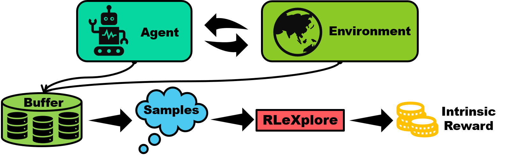

<div align=center>
<br>

<br>


# RLeXplore: Benchmarking Intrinsic Reward Shaping in Reinforcement Learning

RLeXplore is a set of implementations of intrinsic reward driven-exploration approaches in reinforcement learning using PyTorch, which can be deployed in arbitrary algorithms in a plug-and-play manner. In particular, RLeXplore is
designed to be well compatible with [Stable-Baselines3](https://github.com/DLR-RM/stable-baselines3), providing more stable exploration benchmarks. 

<div align=center>

</div>

# Notice
**We will publish a big update recently. You can check this branch https://github.com/RLE-Foundation/rllte/blob/reward/ for the lastest code and there are examples https://github.com/RLE-Foundation/rllte/blob/reward/experimental/ for using RLeXplore with SB3 and CleanRL.**

**This repo has been merged with a new project: [https://github.com/RLE-Foundation/rllte](https://github.com/RLE-Foundation/rllte), in which more reasonable implementations are provided!**

Invoke the intrinsic reward module by:
``` python
from rllte.xplore.reward import ICM, RIDE, ...
```

## Module List (See the notice)
| Module | Remark | Repr.  | Visual | Reference | 
|:-|:-|:-|:-|:-|
| PseudoCounts | Count-Based exploration |✔️|✔️|[Never Give Up: Learning Directed Exploration Strategies](https://arxiv.org/pdf/2002.06038) |
| ICM  | Curiosity-driven exploration  | ✔️|✔️| [Curiosity-Driven Exploration by Self-Supervised Prediction](http://proceedings.mlr.press/v70/pathak17a/pathak17a.pdf) | 
| RND  | Count-based exploration  | ❌|✔️| [Exploration by Random Network Distillation](https://arxiv.org/pdf/1810.12894.pdf) | 
| GIRM | Curiosity-driven exploration  | ✔️ |✔️| [Intrinsic Reward Driven Imitation Learning via Generative Model](http://proceedings.mlr.press/v119/yu20d/yu20d.pdf)|
| NGU | Memory-based exploration  | ✔️  |✔️| [Never Give Up: Learning Directed Exploration Strategies](https://arxiv.org/pdf/2002.06038) | 
| RIDE| Procedurally-generated environment | ✔️ |✔️| [RIDE: Rewarding Impact-Driven Exploration for Procedurally-Generated Environments](https://arxiv.org/pdf/2002.12292)|
| RE3  | Entropy Maximization | ❌ |✔️| [State Entropy Maximization with Random Encoders for Efficient Exploration](http://proceedings.mlr.press/v139/seo21a/seo21a.pdf) |
| RISE  | Entropy Maximization  | ❌  |✔️| [Rényi State Entropy Maximization for Exploration Acceleration in Reinforcement Learning](https://ieeexplore.ieee.org/abstract/document/9802917/) | 
| REVD  | Divergence Maximization | ❌  |✔️| [Rewarding Episodic Visitation Discrepancy for Exploration in Reinforcement Learning](https://openreview.net/pdf?id=V2pw1VYMrDo)|

> - 🐌: Developing.
> - `Repr.`: The method involves representation learning.
> - `Visual`: The method works well in visual RL.

# Example (See the notice)
Due to the large differences in the calculation of different intrinsic reward methods, **rllte** has the following rules:

1. The environments are assumed to be ***vectorized***;
2. The ***compute_irs*** function of each intrinsic reward module has a mandatory argument ***samples***, which is a dict like:
     - obs (n_steps, n_envs, *obs_shape) <class 'torch.Tensor'>
     - actions (n_steps, n_envs, *action_shape) <class 'torch.Tensor'>
     - rewards (n_steps, n_envs) <class 'torch.Tensor'>
     - next_obs (n_steps, n_envs, *obs_shape) <class 'torch.Tensor'>

Take RE3 for instance, it computes the intrinsic reward for each state based on the Euclidean distance between the state and 
its $k$-nearest neighbor within a mini-batch. Thus it suffices to provide ***obs*** data to compute the reward. The following code provides a usage example of RE3:
``` py title="example.py"
from rllte.xplore.reward import RE3
from rllte.env import make_dmc_env
import torch as th

if __name__ == '__main__':
    num_envs = 7
    num_steps = 128
    # create env
    env = make_dmc_env(env_id="cartpole_balance", num_envs=num_envs)
    print(env.observation_space, env.action_space)
    # create RE3 instance
    re3 = RE3(
        observation_space=env.observation_space,
        action_space=env.action_space
    )
    # compute intrinsic rewards
    obs = th.rand(size=(num_steps, num_envs, *env.observation_space.shape))
    intrinsic_rewards = re3.compute_irs(samples={'obs': obs})
    
    print(intrinsic_rewards.shape, type(intrinsic_rewards))
    print(intrinsic_rewards)

# Output:
# {'shape': [9, 84, 84]} {'shape': [1], 'type': 'Box', 'range': [-1.0, 1.0]}
# torch.Size([128, 7]) <class 'torch.Tensor'>
```
